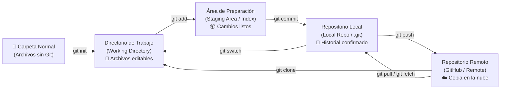
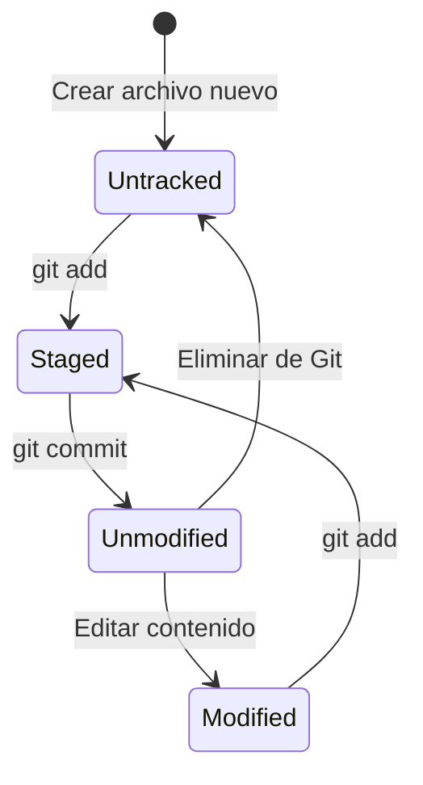

# 02. Fundamentos de Git

[⬅️ Módulo Anterior: Introducción](./01-introduccion.md) | [🏠 Volver al Índice](./README.md) | [Siguiente Módulo: Fundamentos de GitHub ➡️](./03-fundamentos-de-github.md)

## 🏗️ La Arquitectura de Git: ¿Cómo Funciona por Dentro?

Antes de que Git pueda registrar cambios, una carpeta normal de tu computadora debe convertirse en un **repositorio de Git**. Esto se logra ejecutando el comando **`git init`** (o descargando uno existente con **`git clone`**), lo que crea una carpeta oculta llamada **`.git`** que servirá como el "cerebro" de tu proyecto.

A partir de ahí, tu código viaja entre **4 zonas de trabajo**:

### 0. El Punto de Partida: `git init`
Una carpeta normal en tu ordenador no vigila cambios por sí sola. Al ejecutar `git init` dentro de ella, Git crea la carpeta invisible `.git` y la transforma oficialmente en un repositorio local.

### 1. Directorio de Trabajo (Working Directory)
Es la carpeta física en tu disco duro donde creas, editas y eliminas archivos. En esta etapa, las modificaciones aún no han sido registradas por Git.

### 2. Área de Preparación (Staging Area / Index)
Es una zona intermedia (como una bandeja de salida) donde seleccionas con precisión qué cambios específicos formarán parte del próximo guardado (*commit*). Te permite organizar tus cambios de forma lógica y ordenada mediante `git add`.

### 3. Repositorio Local (.git)
Es la base de datos interna de Git guardada en la carpeta oculta `.git`. Almacena todo el historial de versiones (*commits*), ramas y etiquetas en tu propia computadora mediante `git commit`.

### 4. Repositorio Remoto (Remote)
Es la versión del proyecto alojada en un servidor en la nube (ej. GitHub). Permite respaldar tu trabajo y compartirlo con tu equipo mediante `git push` y `git pull`.

## 🔄 Ciclo de Vida de los Estados de un Archivo

Cada archivo en tu proyecto pasa por diferentes estados según cómo interactúes con él:

- **Untracked (Sin seguimiento)**: Archivo nuevo que Git aún no vigila ni tiene en su historial.
- **Tracked (Bajo seguimiento)**:
  - **Unmodified (Sin cambios)**: Idéntico a la última versión guardada en el historial.
  - **Modified (Modificado)**: Se han realizado cambios en el archivo pero aún no se han preparado para guardar.
  - **Staged (Preparado)**: Los cambios ya están seleccionados y listos para guardarse en el próximo commit.

## 🧩 Conceptos Clave Fundamentales

### 📦 Repositorio (Repository / Repo)
Es el contenedor digital donde se almacena el conjunto completo de archivos y todo el historial de revisiones y cambios de un proyecto.

### 📸 Commit (Confirmación de Cambios)
Un commit es el equivalente a un **punto de guardado (checkpoint)** en un videojuego o una **foto instantánea** de tu proyecto en un momento exacto del tiempo.

#### ¿Para qué sirve realmente un Commit?
1. **Viajar en el tiempo con seguridad**: Si una actualización rompe tu aplicación o borras algo por accidente, puedes regresar a cualquier commit anterior sin perder nada.
2. **Entender el motivo de cada cambio**: Cada commit guarda quién lo hizo, en qué fecha y con qué explicación.
3. **Registro histórico documental**: Permite entender la evolución del proyecto paso a paso a lo largo de meses o años.

Cada commit contiene:
- Un identificador único (un código alfanumérico como `7a2b9f...`).
- Un mensaje descriptivo del autor.
- Fecha, hora y autor.
- Un enlace de conexión con el commit anterior (el "padre").

#### 📂 ¿Cuántos archivos se deben incluir en un Commit?
No existe un límite estricto de archivos (puede ser 1 solo archivo o varios), pero la regla de oro es que **el commit sea atómico**:
- **¿Qué es un commit atómico?**: Significa que todos los archivos incluidos deben pertenecer a **una sola tarea o propósito lógico**.
- ✅ **Correcto**: Si creas un formulario de contacto, incluyes `contacto.html`, `estilos.css` y `validar.js` en el mismo commit, porque todos forman parte de esa misma funcionalidad.
- ❌ **Incorrecto**: Modificar el diseño del menú, arreglar un bug en la base de datos y cambiar el texto del pie de página, y guardar todo junto en un único commit gigante.

#### ✍️ La Importancia de los Mensajes de Commit
El mensaje de tu commit es tu carta de comunicación con tu "yo del futuro" y con tus compañeros de equipo.

- ❌ **Ejemplos de Malos Mensajes**:
  - `"si"` *(No explica absolutamente nada de lo que se hizo)*
  - `"main.js"` *(Solo repite el nombre del archivo sin decir qué cambió)*
  - `"cambios"`, `"update"`, `"asdasd"` *(Imposible saber qué ocurrió al revisar el historial después)*
- ✅ **Ejemplos de Buenos Mensajes**:
  - `"feat: agregar formulario de login con validación de contraseña"`
  - `"fix: corregir error al calcular el total en el carrito de compras"`
  - `"docs: añadir guía de instalación en el README"`

#### 🏷️ El Estándar de la Industria: Conventional Commits
En el ámbito profesional y en proyectos *open source*, se utiliza una convención estándar de prefijos para categorizar los commits al instante:
- `feat:` para una nueva funcionalidad.
- `fix:` para solucionar un error o bug.
- `docs:` para cambios exclusivos en la documentación.
- `style:` para formato, espacios o estilos visuales (sin alterar lógica).
- `refactor:` para reestructurar código sin añadir funciones ni arreglar bugs.
- `test:` para añadir o modificar pruebas.
- `chore:` para tareas de mantenimiento o actualización de dependencias.

### 🌿 Rama (Branch)
Imagina una rama como una **línea de tiempo paralela** o un **espacio de trabajo seguro** de tu proyecto:
- **¿Para qué sirve?**: Te permite experimentar, añadir nuevas características o corregir errores en total aislamiento, sin miedo a romper el código que ya funciona en la rama principal (`main` o `master`).
- **¿Cómo funciona?**: Trabajas libremente en tu rama. Si la idea no funciona, la eliminas sin consecuencias; si todo sale perfecto, la integras (*fusionas / merge*) a la rama principal.
- **Trabajo en equipo**: Permite que varios desarrolladores trabajen al mismo tiempo en diferentes funciones del mismo proyecto sin estorbarse ni sobrescribir el trabajo de los demás.

### 🎯 HEAD
Es como el indicador **"📍 Usted está aquí"** de un mapa. Es un marcador de posición que le dice a Git en qué rama o versión específica estás parado trabajando en este momento.

---

[⬅️ Módulo Anterior: Introducción](./01-introduccion.md) | [🏠 Volver al Índice](./README.md) | [Siguiente Módulo: Fundamentos de GitHub ➡️](./03-fundamentos-de-github.md)
