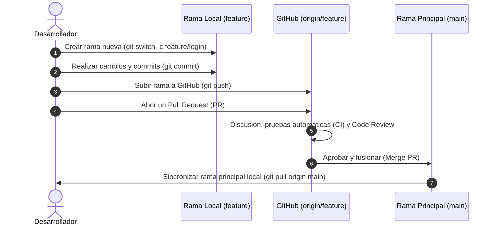

# 03. Fundamentos de GitHub

[⬅️ Módulo Anterior: Fundamentos de Git](./02-fundamentos-de-git.md) | [🏠 Volver al Índice](./README.md) | [Siguiente Módulo: Instalación y Configuración ➡️](./04-instalacion-y-configuracion.md)

## 🐙 ¿Qué es GitHub y qué nos ofrece?

**GitHub** es la mayor plataforma de desarrollo colaborativo del mundo. Mientras que Git se encarga de registrar el historial de cambios en tu máquina local, GitHub añade una potente capa social y de gestión en la nube que permite a millones de desarrolladores trabajar juntos en proyectos de cualquier escala.

## 🧩 Conceptos Clave de GitHub

### 1. Repositorio Remoto (Remote Repo)
Es la copia central de tu proyecto alojada en los servidores de GitHub. Actúa como el punto de encuentro donde tú y tu equipo sincronizan sus avances.
- **Público**: Visible para cualquier persona en internet (ideal para código abierto y portafolio).
- **Privado**: Solo accesible para ti y los colaboradores que autorices expresamente.

### 2. Fork (Bifurcación) vs. Clone (Clonación)
- **Clone (`git clone`)**: Descarga una copia exacta del repositorio remoto a tu computadora local para trabajar en él.
- **Fork**: Crea una copia independiente de un repositorio ajeno dentro de **tu propia cuenta de GitHub**. Te permite hacer experimentos o mejoras sin afectar el proyecto original.

### 3. Issues (Gestión de Tareas y Errores)
Son tickets o fichas de trabajo integradas en cada repositorio. Se utilizan para:
- Reportar errores (*bugs*).
- Proponer nuevas funcionalidades (*feature requests*).
- Asignar tareas a miembros del equipo.

### 4. Pull Request (PR) y Code Review
Un **Pull Request** es una solicitud formal para que el dueño o equipo de un proyecto revise y fusione (*merge*) los cambios que hiciste en tu rama hacia la rama principal.
- **Code Review**: Permite que otros programadores comenten líneas de código específicas, sugieran mejoras o aprueben la integración.

### 5. Stars ⭐, Watch 👁️ y Forks 🍴
Son elementos de interacción comunitaria en GitHub:
- **Star (⭐)**: Equivalente a un "marcador favorito" o "me gusta", ayuda a dar visibilidad a proyectos destacados.
- **Watch (👁️)**: Te suscribe a notificaciones sobre nuevas versiones, issues o discusiones del repositorio.
- **Fork (🍴)**: Muestra cuántas personas han copiado el proyecto para experimentar o contribuir.

## 🌊 El Flujo de Trabajo Moderno: GitHub Flow

El modelo estándar de trabajo en la industria y en proyectos *open source* sigue el ciclo **GitHub Flow**:

### Paso a paso del ciclo:
1. **Crear una rama**: Partiendo siempre de la versión más reciente de `main` con un nombre descriptivo (ej. `feature/autenticacion`, `fix/boton-inicio`).
2. **Hacer commits regulares**: Guardar cambios pequeños, atómicos y con mensajes claros.
3. **Abrir un Pull Request (PR)**: Describir qué se hizo, qué problema resuelve y solicitar la revisión del equipo.
4. **Revisión de código (Code Review)**: El equipo valida que el código cumpla con los estándares de calidad y que las pruebas automáticas pasen.
5. **Merge y Despliegue**: Se fusionan los cambios aprobados en `main` y la rama temporal se elimina para mantener limpio el repositorio.

---

[⬅️ Módulo Anterior: Fundamentos de Git](./02-fundamentos-de-git.md) | [🏠 Volver al Índice](./README.md) | [Siguiente Módulo: Instalación y Configuración ➡️](./04-instalacion-y-configuracion.md)
