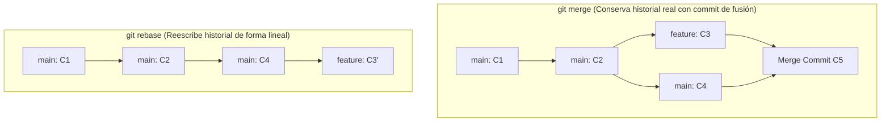

# 05. Chuleta Definitiva de Comandos Git (Cheat Sheet)

[⬅️ Módulo Anterior: Instalación y Configuración](./04-instalacion-y-configuracion.md) | [🏠 Volver al Índice](./README.md) | [Siguiente Módulo: Dominando Markdown ➡️](./06-dominando-markdown.md)


## 🧭 Tabla Rápida de Comandos Más Usados

```bash
git init                 # Inicializar repo local
git clone <url>          # Clonar repo remoto
git status               # Ver estado de archivos
git add .                # Preparar todos los cambios para commit
git commit -m "mensaje"  # Guardar instantánea con mensaje
git push origin <rama>   # Subir commits al servidor remoto
git pull origin <rama>   # Descargar y fusionar cambios remotos
git switch -c <nueva>    # Crear y cambiar a una nueva rama
```


## 📦 1. Inicialización y Clonación

| Comando | Descripción |
| :--- | :--- |
| `git init` | Inicializa un nuevo repositorio Git en el directorio actual. |
| `git init <nombre-carpeta>` | Crea una carpeta nueva e inicializa un repositorio en ella. |
| `git clone <url>` | Descarga una copia completa de un repositorio remoto. |
| `git clone --depth 1 <url>` | Clona solo el último commit (ideal para descargas rápidas o CI/CD). |


### 🚀 Paso a Paso: Subir una carpeta con archivos existentes a GitHub

Si ya tienes una carpeta en tu computadora con archivos de tu proyecto y quieres subirla por primera vez a un repositorio nuevo de GitHub:

```bash
# 1. Abre la terminal dentro de tu carpeta del proyecto
# 2. Inicializa Git en la carpeta
git init

# 3. Agrega todos los archivos existentes al área de preparación
git add .

# 4. Guarda tu primer commit con un mensaje descriptivo
git commit -m "feat: initial commit con archivos del proyecto"

# 5. Nombra la rama principal como 'main'
git branch -M main

# 6. Conecta tu carpeta local con el repositorio de GitHub (reemplaza con tu URL)
git remote add origin https://github.com/tuusuario/tu-repositorio.git

# 7. Sube todos tus archivos a GitHub
git push -u origin main
```

> [!TIP]
> **¿Te dio error al hacer `git push` porque el repo de GitHub ya tenía un README o License?**
> Si el repositorio en GitHub no estaba 100% vacío, une ambos historiales con:
> ```bash
> git pull origin main --allow-unrelated-histories
> git push -u origin main
> ```


## 📝 2. Registro y Preparación de Cambios (Staging & Commits)

```bash
# Ver estado de archivos (modificados, staged, untracked)
git status
git status -s                      # Versión compacta

# Agregar archivos al Staging Area
git add archivo.txt                # Archivo específico
git add .                          # Todos los archivos modificados y nuevos
git add -p                         # Modo interactivo (revisar bloque por bloque)

# Crear commits
git commit -m "feat: add user login"
git commit -am "fix: typo in header"  # Agrega modificados y hace commit a la vez

# Modificar el último commit (cambiar mensaje o añadir archivos olvidados)
git commit --amend -m "feat: add user login with validations"
git commit --amend --no-edit       # Añadir cambios al último commit sin cambiar mensaje

# Ver diferencias de código
git diff                           # Diferencias entre Working Directory y Staging
git diff --staged                  # Diferencias entre Staging y el último commit
git diff HEAD~1 HEAD               # Diferencias entre los dos últimos commits
```


## 🌿 3. Ramas (Branching) y Navegación

> [!TIP]
> En versiones modernas de Git, se recomienda usar **`git switch`** para moverte entre ramas y **`git restore`** para deshacer archivos, en lugar del antiguo comando multifunción `git checkout`.

```bash
# Listar ramas
git branch                         # Listar ramas locales
git branch -a                      # Listar ramas locales y remotas
git branch -v                      # Ver ramas con su último commit

# Crear y cambiar de rama (Moderno)
git switch -c feature/contacto     # Crear y cambiar a la rama
git switch feature/contacto        # Cambiar a una rama existente
git switch -                       # Volver a la rama anterior

# Métodos tradicionales (checkout)
git checkout -b feature/contacto   # Equivalente a switch -c
git checkout feature/contacto      # Equivalente a switch

# Eliminar ramas
git branch -d feature/contacto     # Eliminar rama de forma segura (si ya fue fusionada)
git branch -D feature/contacto     # Forzar eliminación de rama (incluso si no fue fusionada)
git push origin --delete rama      # Eliminar rama en el servidor remoto
```


## 🔀 4. Fusión (Merge) vs. Rebase



### Git Merge
```bash
# Desde la rama 'main', fusionar los cambios de 'feature':
git switch main
git merge feature/contacto
```

### Git Rebase
```bash
# Desde tu rama 'feature', poner tus commits encima de los últimos de 'main':
git switch feature/contacto
git rebase main
```

> [!WARNING]
> **Regla de oro del Rebase**: NUNCA hagas rebase sobre ramas públicas o compartidas (como `main`), ya que reescribe los identificadores (hashes) de los commits.


## ☁️ 5. Trabajo Remoto y Sincronización

```bash
# Gestionar remotos
git remote -v                      # Ver URLs de repositorios remotos vinculados
git remote add origin <url>        # Vincular un nuevo repositorio remoto
git remote set-url origin <nueva>  # Cambiar la URL de un remoto existente

# Enviar y recibir cambios
git fetch origin                   # Descarga referencias del remoto sin fusionar
git pull origin main               # Descarga y fusiona en la rama actual (fetch + merge)
git pull --rebase origin main      # Descarga y aplica rebase en lugar de merge
git push -u origin main            # Sube commits y vincula la rama local con la remota (-u)
git push origin feature/nueva      # Sube una rama específica a GitHub
git push --force-with-lease        # Sobrescritura segura tras un rebase (mejor que --force)
```


## 📦 6. Guardar Cambios Temporales (`git stash`)

Ideal cuando necesitas cambiar de rama de urgencia pero tienes trabajo a medio terminar sin querer hacer commit:

```bash
git stash                          # Guarda los cambios actuales en el stash
git stash save "trabajo en navbar" # Guarda con un mensaje descriptivo
git stash list                     # Lista todos los estados guardados
git stash pop                      # Aplica el último stash y lo elimina de la lista
git stash apply                    # Aplica el stash pero lo mantiene guardado
git stash drop stash@{0}           # Elimina un stash específico
git stash clear                    # Borra todos los stashes guardados
```


## ⏪ 7. Deshacer y Rescatar Cambios

```bash
# Descartar modificaciones en el directorio de trabajo (Moderno)
git restore archivo.js             # Descarta cambios no preparados en el archivo
git restore .                      # Descarta todos los cambios no preparados

# Quitar archivos del Staging Area (sin borrar contenido)
git restore --staged archivo.js    # Saca el archivo de staging (unstage)

# Deshacer commits
git revert <commit-hash>           # Crea un nuevo commit que invierte los cambios del anterior (SEGURO)

# Resetear historial (Usar con precaución)
git reset --soft HEAD~1            # Deshace el último commit, mantiene cambios en Staging
git reset --mixed HEAD~1           # Deshace el último commit, mantiene cambios en Working Dir (Default)
git reset --hard HEAD~1            # ⚠️ BORRA el último commit y todos sus cambios

# El salvavidas definitivo: Historial de movimientos de HEAD
git reflog                         # Muestra todos los saltos de HEAD (permite recuperar commits perdidos)
```


## 🏷️ 8. Etiquetas (Tags) y Versiones Semánticas

```bash
# Crear etiquetas
git tag v1.0.0                     # Tag ligera en el commit actual
git tag -a v1.0.0 -m "Release 1.0" # Tag anotada con mensaje (Recomendada)
git tag                            # Listar todas las etiquetas

# Subir etiquetas a GitHub
git push origin v1.0.0             # Subir una etiqueta
git push origin --tags             # Subir todas las etiquetas pendientes
```


## ✍️ 9. Convención de Mensajes de Commit (Conventional Commits)

Escribir mensajes de commit consistentes mejora la legibilidad del historial y facilita la automatización de changelogs:

| Prefijo | Cuándo usarlo | Ejemplo |
| :--- | :--- | :--- |
| `feat:` | Una nueva funcionalidad | `feat: add dark mode toggle` |
| `fix:` | Corrección de un error/bug | `fix: resolve crash on login submit` |
| `docs:` | Cambios solo en documentación | `docs: update API endpoints table` |
| `style:` | Formato, espacios, punto y coma (sin cambios en lógica) | `style: format with prettier` |
| `refactor:` | Refactorización de código (sin nueva función ni fix) | `refactor: simplify auth middleware` |
| `perf:` | Mejora de rendimiento | `perf: optimize image loading` |
| `test:` | Añadir o corregir pruebas | `test: add unit tests for payments` |
| `chore:` | Tareas de mantenimiento, dependencias o tooling | `chore: update dependencies` |

---

[⬅️ Módulo Anterior: Instalación y Configuración](./04-instalacion-y-configuracion.md) | [🏠 Volver al Índice](./README.md) | [Siguiente Módulo: Dominando Markdown ➡️](./06-dominando-markdown.md)
