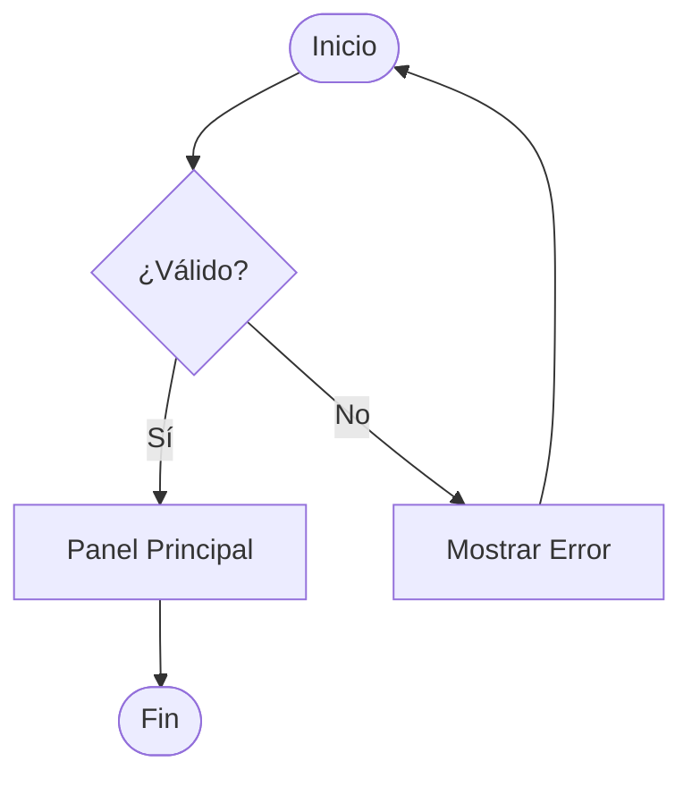
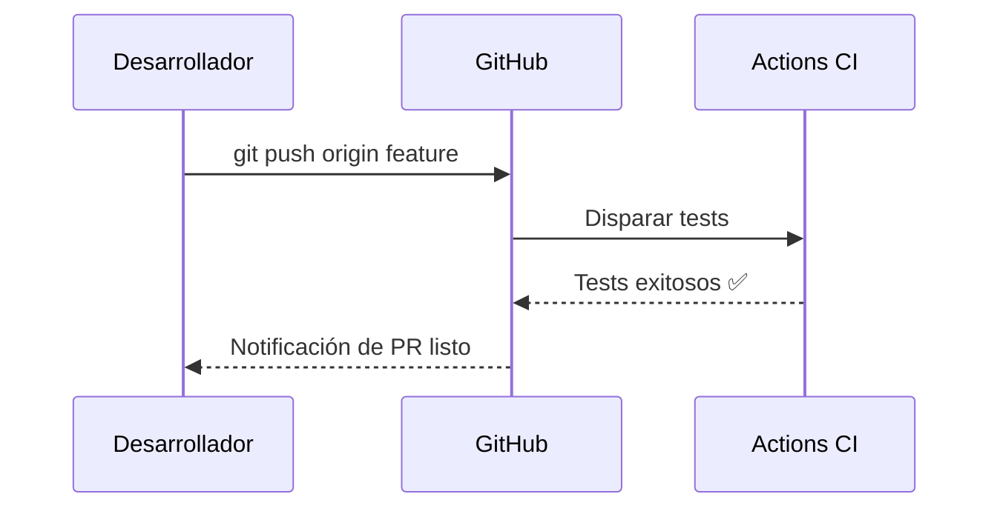
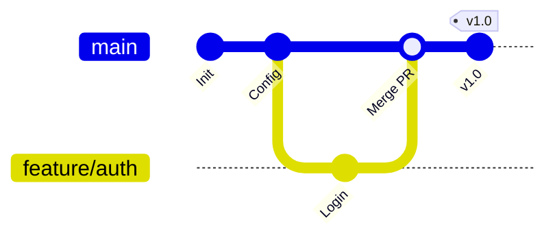
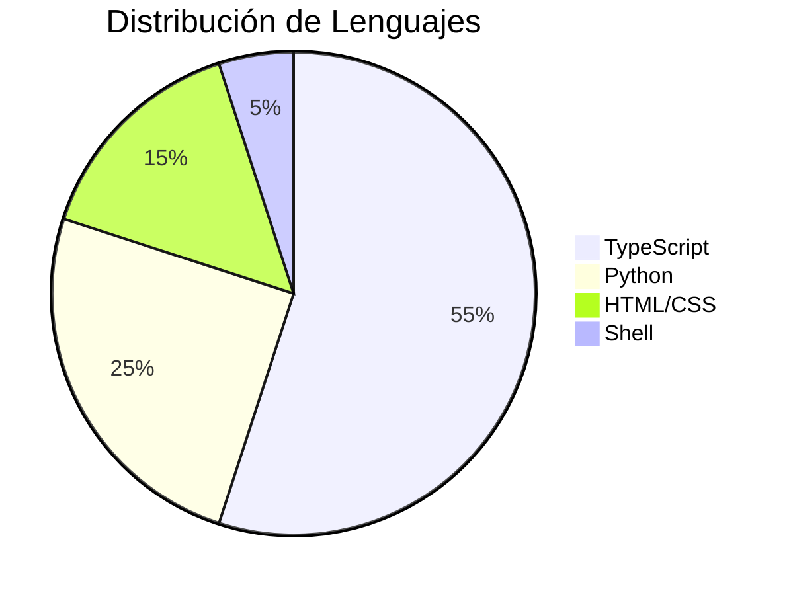
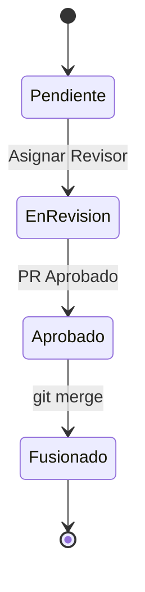

# 07. GFM Avanzado, Componentes Interactivos, Mermaid y LaTeX

[⬅️ Módulo Anterior: Dominando Markdown](./06-dominando-markdown.md) | [🏠 Volver al Índice](./README.md) | [Siguiente Módulo: Estructura del Perfil ➡️](./08-estructura-y-creacion-perfil.md)


## 🚀 ¿Qué es GitHub Flavored Markdown (GFM)?

**GitHub Flavored Markdown (GFM)** es la extensión oficial de GitHub sobre Markdown estándar (CommonMark). Añade herramientas diseñadas específicamente para la colaboración en proyectos de software: alertas visuales, tareas interactivas, renderizado nativo de diagramas Mermaid, fórmulas matemáticas en LaTeX y componentes UI interactivos.


## 🚨 1. Alertas y Callouts Oficiales de GitHub

GitHub proporciona 5 estilos de alertas enriquecidas para destacar avisos críticos en tu documentación:

<table border="0">
  <tr>
    <th width="50%">Código Markdown (GFM)</th>
    <th width="50%">Renderizado Visual</th>
  </tr>
  <tr>
    <td>

```markdown
> [!NOTE]
> Información útil para contextualizar.

> [!TIP]
> Consejo práctico para mejorar productividad.

> [!IMPORTANT]
> Información crucial requerida.

> [!WARNING]
> Advertencia sobre riesgos o configuraciones.

> [!CAUTION]
> Advertencia crítica sobre acciones irreversibles.
```

</td>
<td>

> [!NOTE]
> Información útil para contextualizar.

> [!TIP]
> Consejo práctico para mejorar productividad.

> [!IMPORTANT]
> Información crucial requerida.

> [!WARNING]
> Advertencia sobre riesgos o configuraciones.

> [!CAUTION]
> Advertencia crítica sobre acciones irreversibles.

</td>
</tr>
</table>


## ☑️ 2. Listas de Tareas Interactivas (Task Lists)

En los Issues y Pull Requests de GitHub, puedes hacer clic directamente en las casillas para marcarlas o desmarcarlas:

<table border="0">
  <tr>
    <th width="50%">Código Markdown / HTML</th>
    <th width="50%">Renderizado Visual</th>
  </tr>
  <tr>
    <td>

```markdown
<!-- En Markdown (GFM) -->
- [x] Diseñar arquitectura del software
- [x] Configurar repositorio y ramas
- [ ] Implementar autenticación OAuth
- [ ] Desplegar en producción

<!-- Equivalente en HTML -->
<ul>
  <li><input type="checkbox" checked disabled> Tarea 1</li>
  <li><input type="checkbox" disabled> Tarea 2</li>
</ul>
```

</td>
<td>

- [x] Diseñar arquitectura del software
- [x] Configurar repositorio y ramas
- [ ] Implementar autenticación OAuth
- [ ] Desplegar en producción

<ul>
  <li><input type="checkbox" checked disabled> Tarea 1</li>
  <li><input type="checkbox" disabled> Tarea 2</li>
</ul>

</td>
</tr>
</table>


## 📂 3. Desplegables Interactivos (`<details>` y `<summary>`)

Permite ocultar explicaciones largas, soluciones o registros para mantener la página limpia y ordenada:

<table border="0">
  <tr>
    <th width="50%">Código HTML</th>
    <th width="50%">Renderizado Visual</th>
  </tr>
  <tr>
    <td>

```html
<details>
<summary><strong>🔍 Haz clic aquí para ver la respuesta</strong></summary>

### Explicación detallada
Este contenido permanece oculto hasta que el lector interactúa con el botón.
- Puedes incluir listas.
- Bloques de código:
  ```bash
  npm install mi-libreria
  ```
- E imágenes o tablas.

</details>
```

</td>
<td>

<details>
<summary><strong>🔍 Haz clic aquí para ver la respuesta</strong></summary>

### Explicación detallada
Este contenido permanece oculto hasta que el lector interactúa con el botón.
- Puedes incluir listas.
- Bloques de código:
  ```bash
  npm install mi-libreria
  ```
- E imágenes o tablas.

</details>

</td>
</tr>
</table>


## ⌨️ 4. Estilos de Teclado y UI (`<kbd>`)

Para documentar atajos de teclado o combinaciones de teclas con un aspecto profesional idéntico a las teclas físicas:

<table border="0">
  <tr>
    <th width="50%">Código Markdown / HTML</th>
    <th width="50%">Renderizado Visual</th>
  </tr>
  <tr>
    <td>

```markdown
Presiona <kbd>Ctrl</kbd> + <kbd>Shift</kbd> + <kbd>P</kbd> para abrir la paleta de comandos en VS Code.

En macOS, usa <kbd>Cmd</kbd> + <kbd>Space</kbd> para abrir Spotlight.

Para guardar cambios: <kbd>Ctrl</kbd> + <kbd>S</kbd>.
```

</td>
<td>

Presiona <kbd>Ctrl</kbd> + <kbd>Shift</kbd> + <kbd>P</kbd> para abrir la paleta de comandos en VS Code.  

En macOS, usa <kbd>Cmd</kbd> + <kbd>Space</kbd> para abrir Spotlight.  

Para guardar cambios: <kbd>Ctrl</kbd> + <kbd>S</kbd>.

</td>
</tr>
</table>


## 📊 5. Diagramas Nativos con Mermaid

GitHub renderiza diagramas Mermaid directamente desde bloques de texto plano:

### A. Diagrama de Flujo (Flowchart)

<table border="0">
  <tr>
    <th width="50%">Código Mermaid</th>
    <th width="50%">Renderizado Visual</th>
  </tr>
  <tr>
    <td>

````markdown

````

</td>
<td>



</td>
</tr>
</table>

### B. Diagrama de Secuencia (Sequence Diagram)

<table border="0">
  <tr>
    <th width="50%">Código Mermaid</th>
    <th width="50%">Renderizado Visual</th>
  </tr>
  <tr>
    <td>

````markdown

````

</td>
<td>


</td>
</tr>
</table>

### C. Diagrama de Git (GitGraph)

<table border="0">
  <tr>
    <th width="50%">Código Mermaid</th>
    <th width="50%">Renderizado Visual</th>
  </tr>
  <tr>
    <td>

````markdown

````

</td>
<td>


</td>
</tr>
</table>

### D. Gráfico de Pastel (Pie Chart)

<table border="0">
  <tr>
    <th width="50%">Código Mermaid</th>
    <th width="50%">Renderizado Visual</th>
  </tr>
  <tr>
    <td>

````markdown

````

</td>
<td>


</td>
</tr>
</table>

### E. Diagrama de Estados (State Diagram)

<table border="0">
  <tr>
    <th width="50%">Código Mermaid</th>
    <th width="50%">Renderizado Visual</th>
  </tr>
  <tr>
    <td>

````markdown

````

</td>
<td>


</td>
</tr>
</table>


## 🧮 6. Fórmulas Matemáticas con LaTeX

GitHub soporta la sintaxis estándar de **LaTeX** para renderizar ecuaciones matemáticas de forma nativa:

<table border="0">
  <tr>
    <th width="50%">Código LaTeX en Markdown</th>
    <th width="50%">Renderizado Visual</th>
  </tr>
  <tr>
    <td>

````markdown
<!-- Fórmula en línea con $...$ -->
La famosa fórmula de Einstein es $E = mc^2$.

<!-- Ecuación centrada en bloque con $$...$$ -->
$$
x = \frac{-b \pm \sqrt{b^2 - 4ac}}{2a}
$$

<!-- Sumatoria -->
$$
\sum_{i=1}^{n} i = \frac{n(n+1)}{2}
$$

<!-- Matriz -->
$$
\begin{pmatrix} a & b \\ c & d \end{pmatrix}
$$
````

</td>
<td>

La famosa fórmula de Einstein es $E = mc^2$.

$$
x = \frac{-b \pm \sqrt{b^2 - 4ac}}{2a}
$$

$$
\sum_{i=1}^{n} i = \frac{n(n+1)}{2}
$$

$$
\begin{pmatrix} a & b \\ c & d \end{pmatrix}
$$

</td>
</tr>
</table>


## 🏷️ 7. Menciones, Referencias y Emojis en GitHub

<table border="0">
  <tr>
    <th width="50%">Código Markdown / GFM</th>
    <th width="50%">Renderizado Visual / Efecto</th>
  </tr>
  <tr>
    <td>

```markdown
<!-- Mención de usuario -->
Gracias a @octocat por la contribución.

<!-- Enlace a Issue o PR -->
Resuelve el problema reportado en #42.

<!-- Emojis con código corto -->
:rocket: :tada: :sparkles: :fire: :heart:
```

</td>
<td>

Gracias a [@octocat](https://github.com/octocat) por la contribución.  

Resuelve el problema reportado en `#42`.  

🚀 🎉 ✨ 🔥 ❤️

</td>
</tr>
</table>


## 📌 8. Notas al Pie de Página (Footnotes)

<table border="0">
  <tr>
    <th width="50%">Código Markdown</th>
    <th width="50%">Renderizado Visual</th>
  </tr>
  <tr>
    <td>

```markdown
Git es un sistema distribuido[^1].
Fue creado por Linus Torvalds[^2].

[^1]: Cada clon posee el historial completo.
[^2]: Creador del kernel Linux.
```

</td>
<td>

Git es un sistema distribuido[^1].
Fue creado por Linus Torvalds[^2].

[^1]: Cada clon posee el historial completo.
[^2]: Creador del kernel Linux.

</td>
</tr>
</table>


## 🎨 9. Muestras de Color Hexadecimal (Color Chips GFM)

<table border="0">
  <tr>
    <th width="50%">Código Markdown</th>
    <th width="50%">Renderizado Visual</th>
  </tr>
  <tr>
    <td>

```markdown
- Color Primario: `#1f6feb`
- Color Éxito: `#238636`
- Color Peligro: `#da3633`
- Color Alerta: `#d29922`
```

</td>
<td>

- Color Primario: `#1f6feb`
- Color Éxito: `#238636`
- Color Peligro: `#da3633`
- Color Alerta: `#d29922`

</td>
</tr>
</table>

---

[⬅️ Módulo Anterior: Dominando Markdown](./06-dominando-markdown.md) | [🏠 Volver al Índice](./README.md) | [Siguiente Módulo: Estructura del Perfil ➡️](./08-estructura-y-creacion-perfil.md)
