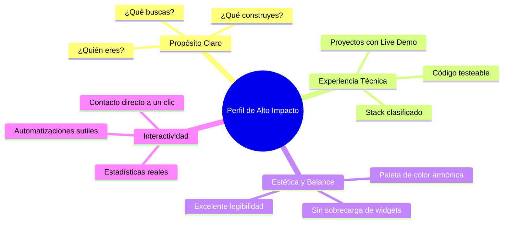

# 10. Perfiles Inspiradores y Galería de Plantillas

[⬅️ Módulo Anterior: Badges y Widgets](./09-badges-widgets-y-metricas.md) | [🏠 Volver al Índice](./README.md) | [Siguiente Módulo: Automatizaciones y Actions ➡️](./11-automatizaciones-y-actions.md)

## 🎨 La Inspiración Detrás de un Perfil Extraordinario

Un perfil de GitHub no es solo un currículum técnico: es tu **carta de presentación digital ante la comunidad de código abierto, reclutadores y líderes técnicos**. La regla de oro en el reclutamiento tecnológico es que **tienes menos de 10 segundos para capturar el interés del visitante**.

En este módulo encuentras directamente nuestras **4 plantillas maestras listas para copiar**, los perfiles más creativos de la comunidad y un checklist para publicar tu perfil con éxito.

## 📑 Índice de Contenidos

- [💻 1. Nuestras 4 Plantillas Listas para Usar](#-1-nuestras-4-plantillas-listas-para-usar)
- [👁️ 2. ¿Qué hace destacar a un Perfil Profesional?](#️-2-qué-hace-destacar-a-un-perfil-profesional)
- [🌟 3. Perfiles Inspiradores de la Comunidad](#-3-perfiles-inspiradores-de-la-comunidad)
  - [A. Minimalistas y Tipográficos](#a-minimalistas-y-tipográficos)
  - [B. Interactivos y Gamificados](#b-interactivos-y-gamificados)
  - [C. Más Perfiles Recomendados por la Comunidad](#c-más-perfiles-recomendados-por-la-comunidad)
- [📚 4. Colecciones y Repositorios "Awesome Profile README"](#-4-colecciones-y-repositorios-awesome-profile-readme)
- [✅ 5. Checklist de Publicación de tu Perfil](#-5-checklist-de-publicación-de-tu-perfil)

## 💻 1. Nuestras 4 Plantillas Listas para Usar

Hemos preparado **4 plantillas optimizadas** en la carpeta [`plantillas/`](./plantillas/README.md), cada una con su **vista previa renderizada en vivo** y su bloque de código Markdown listo para copiar:

<table border="0">
  <tr>
    <th width="50%">💻 Full-Stack Developer</th>
    <th width="50%">✨ Minimalista & Elegante</th>
  </tr>
  <tr>
    <td align="center">
      
<b>Completa y Moderna</b>

      
Typing SVG animado, badges de redes, stack tecnológico categorizado por capas, proyectos en tabla comparativa y métricas.

       
      <a href="./plantillas/plantilla-fullstack.md"><strong>👉 Ver Plantilla Full-Stack</strong></a>
    </td>
    <td align="center">
      
<b>Limpia y Sobria</b>

      
Centrada en tipografía de alta calidad, enlaces directos, experiencia y proyectos seleccionados sin sobrecarga visual.

       
      <a href="./plantillas/plantilla-minimalista.md"><strong>👉 Ver Plantilla Minimalista</strong></a>
    </td>
  </tr>
  <tr>
    <th width="50%">🤖 Data Science & AI</th>
    <th width="50%">🎓 Estudiante & Junior</th>
  </tr>
  <tr>
    <td align="center">
      
<b>Científica y de Datos</b>

      
Badges para Kaggle, HuggingFace y Google Scholar, stack de Machine Learning/MLOps y proyectos de análisis predictivo.

       
      <a href="./plantillas/plantilla-data-ia.md"><strong>👉 Ver Plantilla Data Science</strong></a>
    </td>
    <td align="center">
      
<b>Formativa y de Crecimiento</b>

      
Enfocada en metas de aprendizaje, tecnologías dominadas vs en estudio, proyectos de práctica y llamado al contacto laboral.

       
      <a href="./plantillas/plantilla-junior.md"><strong>👉 Ver Plantilla Junior</strong></a>
    </td>
  </tr>
</table>

## 👁️ 2. ¿Qué hace destacar a un Perfil Profesional?

Los perfiles más efectivos combinan **estructura, estética y propósito**:

## 🌟 3. Perfiles Inspiradores de la Comunidad

### A. Minimalistas y Tipográficos
Enfocados en la claridad del texto, la trayectoria y los proyectos de código abierto sin saturar con widgets pesados:

- 👤 [**sindresorhus** (Sindre Sorhus)](https://github.com/sindresorhus): Uno de los mayores mantenedores de Open Source del mundo; perfil sobrio y enfocado en sus cientos de paquetes de Node.js y extensiones.
- 👤 [**simonw** (Simon Willison)](https://github.com/simonw): Co-creador de Django; perfil auto-actualizado que lista sus releases de software y notas técnicas.
- 👤 [**antfu** (Anthony Fu)](https://github.com/antfu): Miembro del equipo de Vue y Vite; perfil elegante con estadísticas de patrocinadores y proyectos activos.
- 👤 [**kautukkundan** (Kautuk Kundan)](https://github.com/kautukkundan): Banner ASCII y perfil minimalista.

---

### B. Interactivos y Gamificados
Llevan GitHub al límite utilizando acciones para jugar o interactuar en tiempo real:

- 👤 [**Platane**](https://github.com/Platane): Creador de la serpiente de commits que devora el calendario de contribuciones.
- 👤 [**BrunnerLivio** (Livio Brunner)](https://github.com/BrunnerLivio): Implementó el primer libro de visitas interactivo donde los visitantes firman abriendo un Issue.
- 👤 [**timburgan** (Tim Burgan)](https://github.com/timburgan): Perfil interactivo con juegos dentro del README, actualmente Ajedrez.

---

### C. Más Perfiles Recomendados por la Comunidad

<table width="100%" border="0">
<tr>
<td valign="top" width="33%">

- 👤 [**simonw**](https://github.com/simonw)
- 👤 [**matyo91**](https://github.com/matyo91)
- 👤 [**fnky**](https://github.com/fnky)
- 👤 [**BrunnerLivio**](https://github.com/BrunnerLivio)
- 👤 [**sindresorhus**](https://github.com/sindresorhus)
- 👤 [**notKimu**](https://github.com/notKimu)

</td>
<td valign="top" width="34%">

- 👤 [**sammwyy**](https://github.com/sammwyy)
- 👤 [**edulazaro**](https://github.com/edulazaro)
- 👤 [**Svetlozarko**](https://github.com/Svetlozarko)
- 👤 [**CrawKatt**](https://github.com/CrawKatt)
- 👤 [**LaDuquesaDev**](https://github.com/LaDuquesaDev)
- 👤 [**erikgiovani**](https://github.com/erikgiovani)

</td>
<td valign="top" width="33%">

- 👤 [**alexandresanlim**](https://github.com/alexandresanlim)
- 👤 [**kevin-dev71**](https://github.com/kevin-dev71)
- 👤 [**AVIVASHISHTA29**](https://github.com/AVIVASHISHTA29)
- 👤 [**carlosazaustre**](https://github.com/carlosazaustre)
- 👤 [**jlengstorf**](https://github.com/jlengstorf)
- 👤 [**ema28pro**](https://github.com/ema28pro)

</td>
</tr>
</table>

## 📚 4. Colecciones y Repositorios "Awesome Profile README"

Si deseas explorar miles de ejemplos creados por la comunidad global:

| Repositorio | Descripción | Enlace |
| :--- | :--- | :---: |
| **Awesome GitHub Profile README** | La colección más grande y popular (+25k ⭐) de perfiles destacados por categoría. | [🌟 Ver Repositorio](https://github.com/abhisheknaiidu/awesome-github-profile-readme) |
| **Awesome Profile README Templates** | Catálogo curado con plantillas de código abierto listas para usar. | [📂 Ver Plantillas](https://github.com/kautukkundan/Awesome-Profile-README-templates) |
| **Beautify GitHub Profile** | Guía visual y colección de recursos para embellecer cualquier repositorio. | [🎨 Explorar](https://github.com/rzashakeri/beautify-github-profile) |
| **Awesome README** | Ejemplos de los mejores READMEs para proyectos de software y librerías. | [📖 Ver Colección](https://github.com/matiassingers/awesome-readme) |

## ✅ 5. Checklist de Publicación de tu Perfil

Antes de dar por terminado tu perfil, realiza esta verificación rápida:

- [ ] **Nombre y Bio**: Tu nombre real y una biografía breve en tu perfil con tu especialidad y propuesta de valor.
- [ ] **Enlaces de Contacto Verificados**: Todos los enlaces a LinkedIn, correo y portafolio abren correctamente.
- [ ] **Proyectos con Enlace y Demo**: Cada proyecto incluye un enlace al código fuente y al despliegue en vivo (*live demo*).
- [ ] **Modo Claro y Modo Oscuro**: Las imágenes y widgets se leen bien tanto en fondo negro como en fondo blanco.
- [ ] **Ortografía y Formato**: Sin errores de sintaxis Markdown, etiquetas HTML sin cerrar ni tablas desalineadas.
- [ ] **Repositorios Fijados (*Pinned*)**: Has configurado tus 6 mejores proyectos en el inicio de tu cuenta.

---

[⬅️ Módulo Anterior: Badges y Widgets](./09-badges-widgets-y-metricas.md) | [🏠 Volver al Índice](./README.md) | [Siguiente Módulo: Automatizaciones y Actions ➡️](./11-automatizaciones-y-actions.md)
