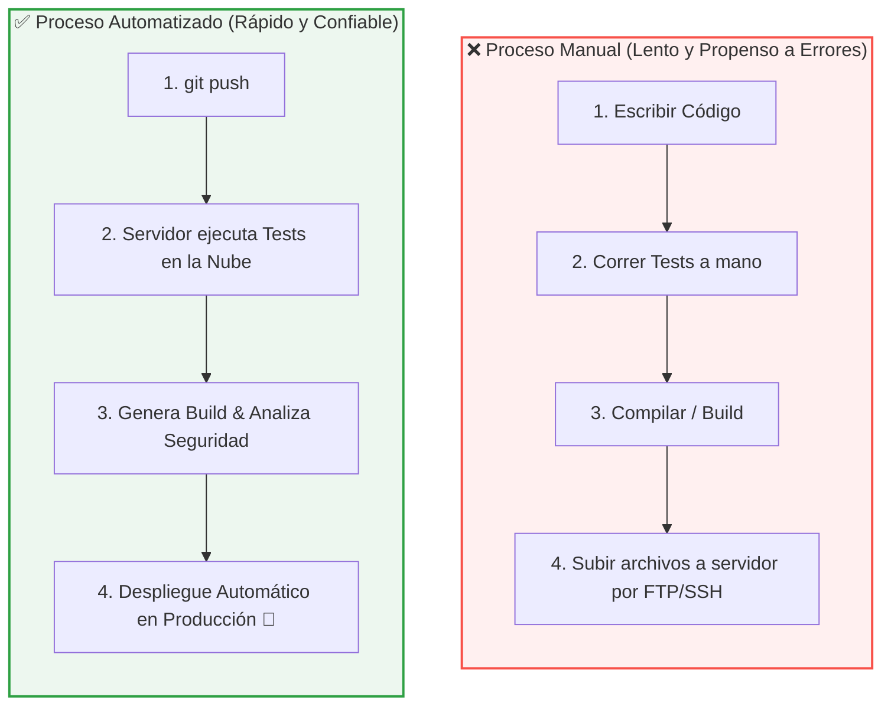
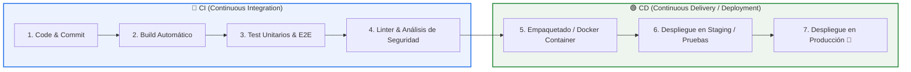
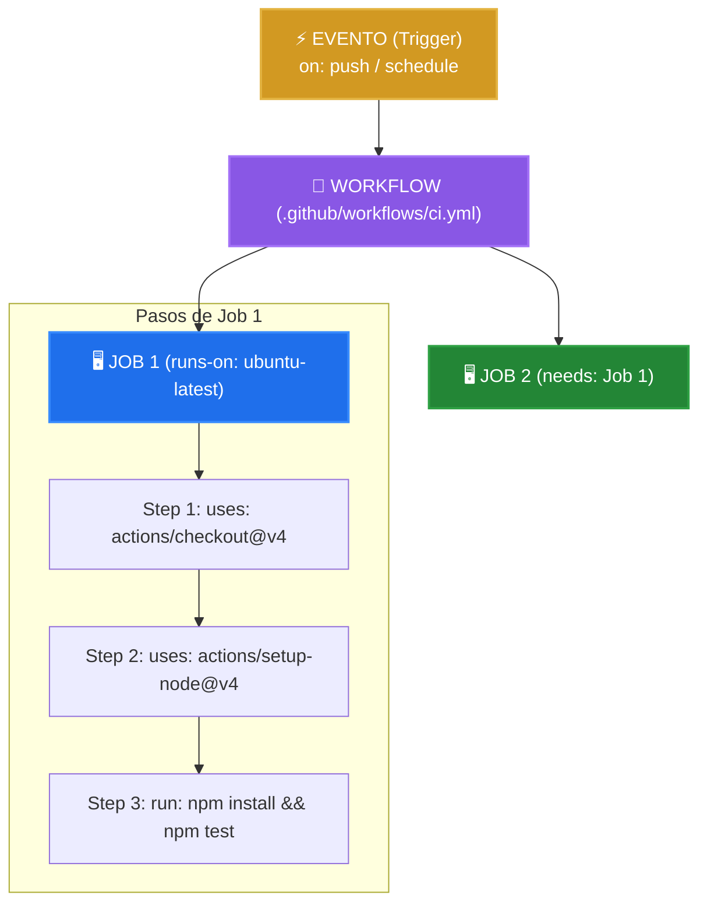
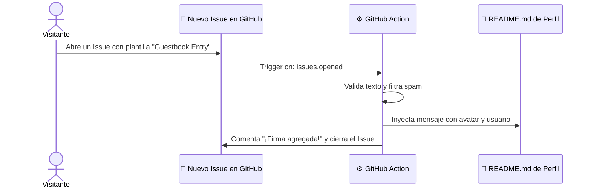

# 11. Automatizaciones, CI/CD y GitHub Actions

[⬅️ Módulo Anterior: Perfiles Inspiradores y Plantillas](./10-perfiles-inspiradores-y-plantillas.md) | [🏠 Volver al Índice](./README.md) | [Siguiente Módulo: Recursos y Curaduría ➡️](./12-recursos-y-curaduria.md)


## 🚀 De la Tarea Manual a la Automatización Total

En el desarrollo de software moderno, **cualquier tarea repetitiva que deba ejecutarse más de dos veces debe ser automatizada**. Desde compilar código y ejecutar pruebas hasta sincronizar métricas, generar arte dinámico y desplegar aplicaciones en producción, la automatización garantiza consistencia, velocidad y elimina el error humano.


## 📑 Índice de Contenidos

- [⚙️ 1. Fundamentos de Automatización y CI/CD](#️-1-fundamentos-de-automatización-y-cicd)
  - [A. ¿Por qué automatizar en el desarrollo de software?](#a-por-qué-automatizar-en-el-desarrollo-de-software)
  - [B. Ciclo de Vida CI/CD (Continuous Integration & Continuous Deployment)](#b-ciclo-de-vida-cicd-continuous-integration--continuous-deployment)
- [🐙 2. Arquitectura y Conceptos de GitHub Actions](#-2-arquitectura-y-conceptos-de-github-actions)
  - [A. Los 6 Conceptos Fundamentales](#a-los-6-conceptos-fundamentales)
  - [B. Anatomía Visual de un Workflow](#b-anatomía-visual-de-un-workflow)
- [🤖 3. Automatizaciones y Componentes Dinámicos para tu Perfil](#-3-automatizaciones-y-componentes-dinámicos-para-tu-perfil)
  - [A. La Serpiente de Contribuciones (Platane/snk)](#a-la-serpiente-de-contribuciones-platanesnk)
  - [B. Infografías Completas con GitHub Metrics (lowlighter/metrics)](#b-infografías-completas-con-github-metrics-lowlightermetrics)
  - [C. Estadísticas de Desarrollo en Texto/Barras (WakaTime Readme Stats)](#c-estadísticas-de-desarrollo-en-textobarras-wakatime-readme-stats)
  - [D. Sincronización Automática de Artículos del Blog (RSS Feed)](#d-sincronización-automática-de-artículos-del-blog-rss-feed)
  - [E. Auto-actualización de Releases, TILs y Actividad (Estilo Simon Willison)](#e-auto-actualización-de-releases-tils-y-actividad-estilo-simon-willison)
  - [F. Libro de Visitas Interactivo en tu README (Guestbook de Livio Brunner)](#f-libro-de-visitas-interactivo-en-tu-readme-guestbook-de-livio-brunner)
  - [G. SVGs Animados y Arte ASCII Dinámico (Estilo Avi Vashishta)](#g-svgs-animados-y-arte-ascii-dinámico-estilo-avi-vashishta)
  - [H. Badges Automatizados de Retos de Código (aoc-badges-action)](#h-badges-automatizados-de-retos-de-código-aoc-badges-action)
  - [I. Gráfico de Contribuciones en 3D (github-profile-3d-contrib)](#i-gráfico-de-contribuciones-en-3d-github-profile-3d-contrib)
  - [J. Ranking de Usuarios Más Activos por País (Top GitHub Users - Gayan Voice)](#j-ranking-de-usuarios-más-activos-por-país-top-github-users---gayan-voice)
- [🧪 4. Ejemplo Práctico: Pipeline de CI/CD para Proyectos Reales](#-4-ejemplo-práctico-pipeline-de-cicd-para-proyectos-reales)
- [🛡️ 5. Buenas Prácticas y Seguridad en GitHub Actions](#️-5-buenas-prácticas-y-seguridad-en-github-actions)


## ⚙️ 1. Fundamentos de Automatización y CI/CD

### A. ¿Por qué automatizar en el desarrollo de software?

La **automatización** consiste en crear flujos de trabajo programados que ejecutan tareas técnicas sin intervención humana directa:



- **Consistencia**: Las máquinas ejecutan exactamente los mismos pasos cada vez, sin olvidar configuraciones ni saltarse pruebas.
- **Detección temprana de errores**: Si un commit rompe una funcionalidad, el sistema avisa de inmediato antes de que llegue a producción.
- **Productividad**: Los desarrolladores se enfocan en crear valor y escribir código, no en tareas operativas mecánicas.

---

### B. Ciclo de Vida CI/CD (Continuous Integration & Continuous Deployment)



1. **Integración Continua (CI)**: Fusionar cambios frecuentemente con validación automática (pruebas unitarias, análisis estático de código y builds).
2. **Entrega Continua (Continuous Delivery)**: Código siempre listo para ser desplegado en producción tras pasar todas las pruebas.
3. **Despliegue Continuo (Continuous Deployment)**: Despliegue 100% automatizado a servidores de producción sin requerir aprobaciones manuales.


## 🐙 2. Arquitectura y Conceptos de GitHub Actions

**GitHub Actions** es el motor de automatización y CI/CD integrado nativamente en GitHub. Permite crear flujos de trabajo (*workflows*) que reaccionan a cualquier evento que ocurra en tu repositorio.

### A. Los 6 Conceptos Fundamentales:

1. **Workflow (Flujo de Trabajo)**:
   - Archivo YAML ubicado en la carpeta `.github/workflows/nombre-del-workflow.yml`. Define el proceso automatizado completo.
2. **Events / Triggers (`on:`)**:
   - El detonante que inicia el workflow (`on: push`, `on: pull_request`, `on: schedule` para cron, `on: workflow_dispatch` para ejecución manual).
3. **Jobs (Trabajos)**:
   - Un conjunto de pasos (*steps*) que se ejecutan en un mismo runner. Múltiples jobs corren en **paralelo** por defecto o en **secuencia** con `needs: [nombre_job]`.
4. **Runners (Entornos de Ejecución)**:
   - Servidores virtuales en la nube administrados por GitHub (`ubuntu-latest`, `windows-latest`, `macos-latest`) o auto-hospedados (*self-hosted*).
5. **Steps & Actions (Pasos y Acciones)**:
   - Tareas dentro de un Job: comandos de terminal directos (`run: npm test`) o módulos comunitarios reutilizables (`uses: actions/checkout@v4`).
6. **Secrets & Contexts (`${{ secrets.TOKEN }}`)**:
   - Almacenamiento seguro de credenciales cifradas (API Keys, tokens de acceso) en **Settings** → **Secrets and variables** → **Actions**.

---

### B. Anatomía Visual de un Workflow:




## 🤖 3. Automatizaciones y Componentes Dinámicos para tu Perfil

A continuación se presentan los principales ejemplos de automatización comunitaria para hacer que tu `README.md` se actualice en tiempo real:

---

### A. La Serpiente de Contribuciones ([Platane/snk](https://github.com/Platane/snk))

Convierte tu historial de commits en una animación del clásico juego *Snake*:

```yaml
# En .github/workflows/snake.yml
name: Generate Snake Game

on:
  schedule:
    - cron: "0 0 * * *" # Se ejecuta diariamente a las 00:00 UTC
  workflow_dispatch:
  push:
    branches: [main]

jobs:
  build:
    runs-on: ubuntu-latest
    permissions:
      contents: write
    steps:
      - name: Checkout repo
        uses: actions/checkout@v4

      - name: Generate Snake SVG
        uses: Platane/snk@v3
        with:
          github_user_name: ${{ github.repository_owner }}
          outputs: |
            dist/github-snake.svg
            dist/github-snake-dark.svg?palette=github-dark

      - name: Push Snake SVG to output branch
        uses: crazy-max/ghaction-github-pages@v4
        with:
          target_branch: output
          build_dir: dist
        env:
          GITHUB_TOKEN: ${{ secrets.GITHUB_TOKEN }}
```

```html
<!-- En tu README.md: -->
<div align="center">
  <picture>
    <source media="(prefers-color-scheme: dark)" srcset="https://raw.githubusercontent.com/tuusuario/tuusuario/output/github-snake-dark.svg">
    <source media="(prefers-color-scheme: light)" srcset="https://raw.githubusercontent.com/tuusuario/tuusuario/output/github-snake.svg">
    
  </picture>
</div>
```

---

### B. Infografías Completas con GitHub Metrics ([lowlighter/metrics](https://github.com/lowlighter/metrics))

El generador de infografías más potente de la comunidad con más de 40 plugins para renderizar hábitos de programación, líneas de código, música, logros y más:

```yaml
# En .github/workflows/metrics.yml
name: Metrics
on:
  schedule: [{cron: "0 0 * * *"}]
  workflow_dispatch:
  push: {branches: ["main"]}

jobs:
  github-metrics:
    runs-on: ubuntu-latest
    permissions:
      contents: write
    steps:
      - uses: lowlighter/metrics@latest
        with:
          token: ${{ secrets.METRICS_TOKEN }}
          user: tuusuario
          template: classic
          base: header, activity, community, repositories, metadata
          config_timezone: America/Bogota
          plugin_languages: yes
          plugin_languages_details: bytes-size, percentage
          plugin_habits: yes
          plugin_habits_from: 200
          plugin_habits_days: 14
          plugin_habits_facts: yes
          plugin_habits_charts: yes
```

```html
<!-- En tu README.md: -->
<div align="center">
  
</div>
```

---

### C. Estadísticas de Desarrollo en Texto/Barras ([WakaTime Readme Stats](https://github.com/marketplace/actions/profile-readme-development-stats))

Inyecta estadísticas de tiempo de desarrollo en formato de texto y barras ASCII directamente en el contenido del `README.md`:

```
💬 Programming Languages (Past 7 Days):
TypeScript   18 hrs 42 mins  ████████████████░░░░░░░░   64.2%
Python        6 hrs 15 mins  █████░░░░░░░░░░░░░░░░░░░   21.4%
JavaScript    4 hrs 10 mins  ███░░░░░░░░░░░░░░░░░░░░░   14.4%
```

```markdown
<!-- En tu README.md añade estos marcadores: -->
<!--START_SECTION:waka-->
<!--END_SECTION:waka-->
```

```yaml
# En .github/workflows/waka-readme.yml
name: Waka Readme Stats
on:
  schedule: [{cron: '0 0 * * *'}]
  workflow_dispatch:

jobs:
  update-readme:
    runs-on: ubuntu-latest
    steps:
      - uses: anmol098/waka-readme-stats@master
        with:
          WAKATIME_API_KEY: ${{ secrets.WAKATIME_API_KEY }}
          GH_TOKEN: ${{ secrets.GH_TOKEN }}
          SHOW_PROFILE_VIEWS: "false"
          SHOW_DAYS_OF_WEEK: "true"
          SHOW_SHORT_INFO: "true"
          SHOW_LOC_CHART: "false"
```

---

### D. Sincronización Automática de Artículos del Blog (RSS Feed)

Mantén tu perfil actualizado con tus últimas publicaciones en Dev.to, Medium, Hashnode o tu blog personal:

```markdown
<!-- En tu README.md: -->
### ✍️ Mis Últimos Artículos
<!-- BLOG-POST-LIST:START -->
<!-- BLOG-POST-LIST:END -->
```

```yaml
# En .github/workflows/blog-posts.yml
name: Latest Blog Posts
on:
  schedule: [{cron: '0 0 * * *'}]
  workflow_dispatch:

jobs:
  update-readme-with-blog:
    runs-on: ubuntu-latest
    permissions:
      contents: write
    steps:
      - uses: actions/checkout@v4
      - uses: gautamkrishnar/blog-post-workflow@v1
        with:
          feed_list: "https://dev.to/feed/tuusuario,https://medium.com/feed/@tuusuario"
          max_post_count: 5
```

---

### E. Auto-actualización de Releases, TILs y Actividad ([Estilo Simon Willison](https://github.com/simonw))

El reconocido desarrollador **Simon Willison** (creador de Datasette y co-fundador de Django) popularizó la técnica de usar un script en Python ejecutado por Actions para actualizar su README:
- Consulta la API de GitHub para listar sus últimos **releases de paquetes**.
- Extrae entradas recientes de su repositorio de **TILs** (*Today I Learned*).
- Reescribe el `README.md` y hace commit automáticamente.

```yaml
# En .github/workflows/build.yml
name: Build README
on:
  schedule: [{cron: "0 * * * *"}] # Cada hora
  workflow_dispatch:

jobs:
  build:
    runs-on: ubuntu-latest
    steps:
      - uses: actions/checkout@v4
      - uses: actions/setup-python@v5
        with:
          python-version: "3.11"
      - run: pip install -r requirements.txt
      - run: python build_readme.py
      - name: Commit and push if changed
        run: |
          git config user.name "readme-bot"
          git config user.email "actions@users.noreply.github.com"
          git diff --quiet || (git add README.md && git commit -m "Updated README" && git push)
```

---

### F. Libro de Visitas Interactivo en tu README ([Guestbook de Livio Brunner](https://github.com/BrunnerLivio))

Permite que cualquier visitante de tu perfil deje una firma pública en tu `README.md` abriendo un Issue:



---

### G. SVGs Animados y Arte ASCII Dinámico ([Estilo Avi Vashishta](https://www.avivashishta.com/blog/build-animated-github-profile-readme.html))

Permite generar gráficos vectoriales SVG animados personalizados con arte ASCII y métricas calculadas por código en tiempo real:

```
+------------------------------------------------------------+
|  /\_/\   Developer Profile - Online                        |
| ( o.o )  Current Focus: Distributed Systems & Rust        |
|  > ^ <   Total Commits (2024): 1,420 | Stars: 280 ⭐       |
+------------------------------------------------------------+
```

---

### H. Badges Automatizados de Retos de Código ([aoc-badges-action](https://github.com/J0B10/aoc-badges-action))

Actualiza automáticamente badges de retos (como *Advent of Code*) consultando APIs externas:

```yaml
# En .github/workflows/aoc-badges.yml
name: Update AoC Badges
on:
  schedule: [{cron: '0 6 * * *'}]
  workflow_dispatch:

jobs:
  update-badges:
    runs-on: ubuntu-latest
    permissions:
      contents: write
    steps:
      - uses: actions/checkout@v4
      - uses: J0B10/aoc-badges-action@v3
        with:
          userid: 123456
          session: ${{ secrets.AOC_SESSION }}
          year: 2024
```

---

### I. Gráfico de Contribuciones en 3D ([github-profile-3d-contrib](https://github.com/yoshi389111/github-profile-3d-contrib))

Genera visualizaciones isométricas en 3D del historial de contribuciones:

```yaml
# En .github/workflows/profile-3d.yml
name: GitHub-Profile-3D-Contrib
on:
  schedule: [{cron: "0 18 * * *"}]
  workflow_dispatch:

jobs:
  build:
    runs-on: ubuntu-latest
    permissions:
      contents: write
    steps:
      - uses: actions/checkout@v4
      - uses: yoshi389111/github-profile-3d-contrib@0.7.1
        env:
          GITHUB_TOKEN: ${{ secrets.GITHUB_TOKEN }}
          USERNAME: ${{ github.repository_owner }}
      - run: |
          git config user.name github-actions
          git config user.email github-actions@github.com
          git add -A .
          git commit -m "chore: update 3d contrib" || exit 0
          git push
```

---

### J. Ranking de Usuarios Más Activos por País ([Top GitHub Users - Gayan Voice](https://github.com/gayanvoice/top-github-users))

El proyecto de **Gayan Voice** es un ejemplo masivo de automatización con GitHub Actions que procesa la API GraphQL de GitHub para generar y mantener actualizados los rankings de desarrolladores más activos por país y ciudad:
- Si apareces en el ranking de tu país (ej. Colombia, México, España, Argentina), puedes enlazar tu posición o badge oficial directamente en tu perfil.
- Sirve como caso de estudio de scraping automatizado a gran escala usando Actions sin servidores externos.


## 🧪 4. Ejemplo Práctico: Pipeline de CI/CD para Proyectos Reales

Para comprender cómo se aplica CI/CD en un proyecto de software profesional, aquí tienes un ejemplo de pipeline que corre automáticamente pruebas unitarias y análisis de estilo (*linter*) en cada Pull Request:

```yaml
# En .github/workflows/ci.yml
name: Node.js CI Pipeline

on:
  push:
    branches: [ main, develop ]
  pull_request:
    branches: [ main ]

jobs:
  test-and-lint:
    runs-on: ubuntu-latest

    strategy:
      matrix:
        node-version: [18.x, 20.x] # Prueba en múltiples versiones de Node

    steps:
      - name: 1. Descargar Código (Checkout)
        uses: actions/checkout@v4

      - name: 2. Configurar Entorno de Node.js ${{ matrix.node-version }}
        uses: actions/setup-node@v4
        with:
          node-version: ${{ matrix.node-version }}
          cache: 'npm'

      - name: 3. Instalar Dependencias
        run: npm ci

      - name: 4. Ejecutar Linter (Verificar Formato de Código)
        run: npm run lint

      - name: 5. Ejecutar Pruebas Unitarias
        run: npm test -- --coverage
```

> [!TIP]
> Si alguna de las pruebas o reglas del linter falla, GitHub bloqueará automáticamente la fusión del Pull Request, protegiendo la rama principal de errores en producción.


## 🛡️ 5. Buenas Prácticas y Seguridad en GitHub Actions

1. **Principio de Menor Privilegio**: Otorga únicamente los permisos necesarios en `permissions:` (ej. `contents: write` solo si el workflow debe hacer commit).
2. **Usa Secrets para Credenciales**: Nunca escribas tokens o contraseñas en texto plano dentro de los archivos YAML.
3. **Fija Versiones de Actions**: Usa versiones mayores específicas (`@v4`, `@v3`) o el hash del commit (`@sha`) para evitar que cambios imprevistos en actions de terceros rompan tu flujo.
4. **Optimiza Tiempos de Ejecución**: Utiliza caché de dependencias (`cache: 'npm'` o `cache: 'pip'`) para reducir los minutos consumidos en runners de GitHub.

---

[⬅️ Módulo Anterior: Perfiles Inspiradores y Plantillas](./10-perfiles-inspiradores-y-plantillas.md) | [🏠 Volver al Índice](./README.md) | [Siguiente Módulo: Recursos y Curaduría ➡️](./12-recursos-y-curaduria.md)
