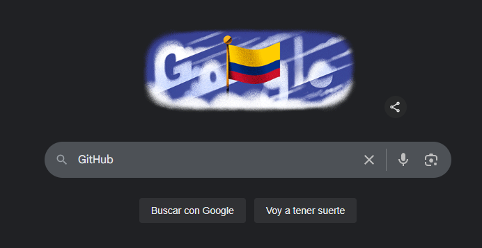
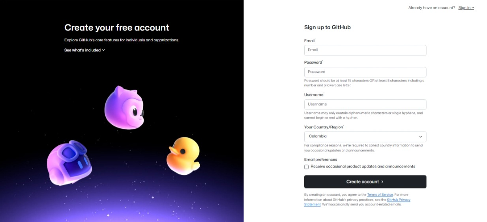
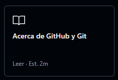
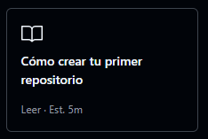
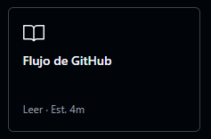
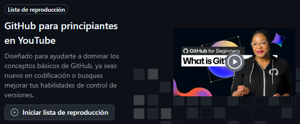
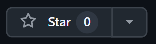

# Introducción a GitHub y pequeña Guía para el perfil de GitHub

¡Bienvenido a esta guía completa de GitHub! Esta documentación te ayudará a dar tus primeros pasos en el mundo del desarrollo colaborativo y el control de versiones.

## 📚 ¿Qué encontrarás en esta guía?

- **🌟 Introducción a GitHub**: Qué es, para qué sirve y por qué es esencial para desarrolladores
- **🚀 Creación de cuenta**: Proceso paso a paso para crear tu cuenta y empezar
- **⚡ Fundamentos de Git**: El sistema de control de versiones que potencia GitHub
- **📝 Tutorial completo de Markdown**: Desde lo básico hasta técnicas avanzadas con HTML y Mermaid
- **💼 Optimización de perfil**: Cómo crear un perfil profesional que destaque y atraiga oportunidades

> [!TIP]
> Esta guía está diseñada tanto para principiantes como para usuarios que quieran perfeccionar sus conocimientos de Markdown y GitHub.

> [!NOTE]
> Si esta guía te resulta útil, puedes apoyarme dándole una ⭐ a este repositorio y siguiéndome en [@ema28pro](https://github.com/ema28pro). ¡Tu apoyo me motiva a crear más contenido! 🙏

---

¡Comencemos por lo primero!

<details>
  <summary><h2>¿Que es GitHub?</h2></summary>

  

  GitHub es una paltaforma que te permite almacenar, compartir y colaborar en código con otros usuarios.  
  La plataforma GitHub simplifica el proceso de colaborar en proyectos y proporciona un sitio web, herramientas de línea de comandos y un flujo global que permite a los desarrolladores y usuarios trabajar juntos.  
  Está basado en Git, un sistema de control de versiones de código abierto que rastrea los cambios en los archivos a lo largo del tiempo.  
  GitHub proporciona una ubicación centralizada para tu código, conocida como **repositorio**, donde puedes administrar y rastrear cambios, revisar código y colaborar sin preocuparte por conflictos.


  
  
  Como su nombre indica, la web utiliza el sistema de control de versiones Git diseñado por Linus Torvalds. Un sistema de gestión de versiones es ese con el que los desarrolladores pueden administrar su proyecto, ordenando el código de cada una de las nuevas versiones que sacan de sus aplicaciones para evitar confusiones. Así, al tener copias de cada una de las versiones de su aplicación, no se perderán los estados anteriores cuando se va a actualizar.

  ### Y que es un Repositorio?

  Un repositorio contiene todos los archivos de tu proyecto y el historial de revisiones de cada uno de ellos. Es una de las partes esenciales que le ayuda a colaborar con personas. Puede utilizar repositorios para administrar el trabajo, realizar un seguimiento de los cambios, almacenar el historial de revisiones y trabajar con otras personas.

</details>

<details>
  <summary><h2>Como crear una cuenta de GitHub</h2></summary>
  
  ### Primero buscamos en nuestro navegador prefierdo ['GitHub'](https://github.com/)
  
  Oh vamos directamente a su sitio web en [**'github.com'**](https://github.com/)

  ### Y nos dirigmos a la ezquina superior derecha en 'Sing up' o Inscribirse/Registrarse
  

  ### Para luego rellenar la informacion que nos piden

  

  ### Y luego de verifiar tu correo, oficialmente ya tendrias tu cuenta de Git Hub

  ```
    ¿Listo para empezar a construir? Crea un repositorio para una nueva
    idea o incorpora uno existente para seguir contribuyendo.
  ```

  ## ¿Por donde empezar?
  
  <table border=2>
    <tr>
    <td align="center">
      <a href="https://docs.github.com/en/get-started/start-your-journey/about-github-and-git"> </a>
    </td>
    <td align="center">
      <a href="https://docs.github.com/es/repositories/creating-and-managing-repositories/quickstart-for-repositories"> </a>
    </td>
    <td align="center">
      <a href="https://docs.github.com/es/get-started/using-github/github-flow"> </a>
    </td>
    </tr>
  </table>

  <table border=2>
    <tr>
    <td align="center">
      <a href="https://youtube.com/playlist?list=PL0lo9MOBetEFcp4SCWinBdpml9B2U25-f&si=I4bOpjwU_bZmklgP"> </a>
    </td>
    <td align="center">
      <a href="https://youtube.com/playlist?list=PL0lo9MOBetEFcp4SCWinBdpml9B2U25-f&si=I4bOpjwU_bZmklgP"> </a>
    </td>
    </tr>
  </table>

  <table border=2>
    <tr>
    <tr>
    <td>
      <a href="https://learn.microsoft.com/es-es/training/modules/introduction-to-github/">  </a>
    </td>
    <td>
      <h3>Introducción a GitHub</h3>
      1 h 39 min. 8 Unidades
    </td>
    <td>
      <a href="https://learn.microsoft.com/es-es/training/modules/intro-to-git/">  </a>
    </td>
    <td>
      <h3>Introducción a Git</h3>
      31 min. 6 Unidades
    </td>
    </tr>
  </table>

</details>

<details>
  <summary><h2>Git</h2></summary>
  
  <div align="right"><sub >From <a href="https://www.freecodecamp.org/espanol/news/guia-para-principiantes-de-git-y-github/" > FreeCodeCamp</a>.</sub></div>

  ### Qué es Git?
  Git es un software de control de versiones gratis y de código abierto. Fue creado por Linus Torvalds en 2005. Esta herramienta es un sistema de control de versiones que fue inicialmente desarrollado para trabajar con varios desarrolladores en el núcleo de Linux.

  Esto significa básicamente que Git es un rastreador de contenido. Así que Git puede ser utilizado para almacenar contenido — y se usa principalmente para almacenar código debido a otras características que proporciona.

  Los proyectos de la vida real generalmente tienen múltiples desarrolladores trabajando en paralelo. Así que necesitan un sistema de control de versiones como Git para asegurarse de que no hay conflictos de código entre ellos.

  Además, los requerimientos en este tipo de proyectos cambian constantemente. Así que un sistema de control de versiones permite a los desarrolladores revertir y regresar a una versión anterior de su código.

  El sistema de ramas en Git permite a los desarrolladores trabajar individualmente en una tarea (Por ejemplo: una rama -> una tarea O una Rama -> un desarrollador). Básicamente, se puede pensar en Git como una aplicación de software pequeña que controla tu código base, si eres un desarrollador.

  

  ### Repositorios Git
  Si queremos empezar a usar Git, necesitamos saber dónde alojar nuestros repositorios.

  Un repositorio (o "Repo" para abreviar) es un proyecto que contiene múltiples archivos. En nuestro caso un repositorio contendrá archivos basados en código.

  Hay dos maneras en que puedes alojar tus repositorios. Uno es en línea (en la nube) y la segunda es fuera de línea (auto-instalado en tu servidor).

  Hay tres servicios de alojamiento popular de Git: GitHub (propiedad de Microsoft), GitLab (propiedad de GitLab) y BitBucket. Usaremos GitHub como nuestro servicio de alojamiento.

  #### Antes de usar Git debemos saber por qué lo necesitamos.
  Git facilita la contribución a proyectos de código abierto
  Casi todos los proyectos de código abierto utilizan GitHub para gestionar sus proyectos. Usar GitHub es gratis si tu proyecto es de código abierto, e incluye un wiki y un rastreador de problemas que facilita la inclusión de documentación más detallada y recibir retroalimentación sobre tu proyecto.

  Si quieres contribuir, simplemente bifurcas (obtienes una copia de) un proyecto, realizas tus cambios, y luego envías un Pull Request al proyecto utilizando la interface web de GitHub. Este Pull Request es tu manera de decirle al proyecto que estás listo para que revisen tus cambios.

  #### Documentación
  Utilizando GitHub, facilitas la obtención de excelente documentación. Su sección de ayuda y las guías tienen artículos para casi cualquier tema relacionado a Git en el que puedas pensar.  

  #### Opciones de Integración
  GitHub puede integrarse con plataformas comunes como Amazon y Google Cloud, con servicios como Code Climate para rastrear tus comentarios y puede resaltar la sintaxis en más de 200 lenguajes de programación diferentes.

  #### Rastrea cambios en tu código a través de versiones
  Cuando varias personas colaboran en un proyecto, es difícil mantener el seguimiento de las revisiones — quién cambió qué, cuándo, y dónde están almacenados esos archivos.

  GitHub se ocupa de este problema manteniendo un seguimiento de todos los cambios que se han enviado al repositorio.

  Al igual que cuando se usa Microsoft Word o Google Drive, puedes tener un historial de las versiones de tu código, de manera que las versiones previas no se pierden con cada iteración. Es fácil regresar a la versión previa y contribuir a tu trabajo.

  #### Muestra tu trabajo
  ¿Eres un desarrollador que desea atraer a reclutadores? GitHub es la mejor herramienta en la que puedes confiar para esto.

  Hoy, al buscar nuevos reclutas para sus proyectos, la mayoría de las compañías miran los perfiles de GitHub. Si tu perfil está disponible, tendrás mayores posibilidades de ser reclutado incluso si no eres de una gran universidad o colegio.

</details>

<details>
  <summary><h2>Markdown</h2></summary>
  
  Antes de comenzar a documentar nuestros proyectos en GitHub, es importante conocer Markdown, un lenguaje de marcado ligero que se utiliza ampliamente para dar formato a archivos de texto, como el README.md. Markdown permite agregar títulos, listas, enlaces, imágenes, fragmentos de código y más, de forma sencilla y legible. Es la herramienta principal para escribir documentación clara y estructurada en GitHub, sin necesidad de conocimientos avanzados en HTML.

  #### Algunos tutoriales:
  - https://tutorialmarkdown.com/
  - https://www.luisllamas.es/curso-markdown/
  - https://denshub.com/es/hugo-post-insert-image/

  ### Qué es Markdown
  Markdown es un lenguaje de marcado con el que puedes agregar formato a documentos de texto plano. Fue creado por John Gruber en el año 2004, siendo a día de hoy uno de los lenguajes de marcado más famosos. Su popularidad se debe a que es sencillo, ligero y fácil de aprender por parte de aquellas personas que no tienen un perfil técnico.

  ### Este es un ejemplo de los Titulos

<table border=0>
  <tr>
  <th> Markdown </th>
  <th> Viewth </th>
  </tr>
  <tr>
  <td>

  ```md
  # Esto es un titulo
  ## Esto es un titulo
  ### Esto es un titulo
  #### Esto es un titulo
  ##### Esto es un titulo
  ###### Esto es un titulo
  ```

  </td>
  <td>

  # Esto es un titulo h1
  ## Esto es un titulo h2
  ### Esto es un titulo h3
  #### Esto es un titulo h4
  ##### Esto es un titulo h5
  ###### Esto es un titulo h6

  </td>
  </tr>
</table>

### y como tambien lee html se puede hacer con las etiquetas h1...h6

<table border=0>
  <tr>
  <th> Markdown </th>
  <th> Viewth </th>
  </tr>

  <tr>
  <td>

  ```md
  <h1> Esto es un titulo </h1>
  <h2> Esto es un titulo </h2>
  <h3> Esto es un titulo </h3>
  <h4> Esto es un titulo </h4>
  <h5> Esto es un titulo </h5>
  <h6> Esto es un titulo </h6>
  ```

  </td>
  <td>

  <h1> Esto es un titulo </h1>
  <h2> Esto es un titulo </h2>
  <h3> Esto es un titulo </h3>
  <h4> Esto es un titulo </h4>
  <h5> Esto es un titulo </h5>
  <h6> Esto es un titulo </h6>

  </td>
  </tr>
</table>

### Formato de Texto

En Markdown puedes aplicar diferentes formatos al texto de manera sencilla:

<table border=0>
  <tr>
  <th> Markdown </th>
  <th> Resultado </th>
  </tr>
  <tr>
  <td>

  ```md
  **Texto en negrita**
  *Texto en cursiva*
  ***Texto en negrita y cursiva***
  ~~Texto tachado~~
  `Código inline`
  
  ### También con HTML:
  <strong>Texto en negrita</strong>
  <em>Texto en cursiva</em>
  <u>Texto subrayado</u>
  <mark>Texto resaltado</mark>
  
  ### Subíndices y Superíndices:
  H<sub>2</sub>O (agua)
  E = mc<sup>2</sup> (Einstein)
  ```

  </td>
  <td>

  **Texto en negrita**  
  *Texto en cursiva*  
  ***Texto en negrita y cursiva***  
  ~~Texto tachado~~  
  `Código inline`
  
  ### También con HTML:
  <strong>Texto en negrita</strong>  
  <em>Texto en cursiva</em>  
  <u>Texto subrayado</u>  
  <mark>Texto resaltado</mark>
  
  ### Subíndices y Superíndices:
  H<sub>2</sub>O (agua)  
  E = mc<sup>2</sup> (Einstein)

  </td>
  </tr>
</table>

### Listas

Markdown soporta tanto listas ordenadas como no ordenadas, pero también puedes usar HTML para más control:

<table border=0>
  <tr>
  <th> Markdown </th>
  <th> Resultado </th>
  </tr>
  <tr>
  <td>

  ```md
  ### Lista no ordenada
  - Elemento 1
  - Elemento 2
    - Subelemento 2.1
    - Subelemento 2.2
  - Elemento 3

  ### Lista ordenada
  1. Primer elemento
  2. Segundo elemento
     1. Subelemento 2.1
     2. Subelemento 2.2
  3. Tercer elemento

  ### Lista de tareas
  - [x] Tarea completada
  - [ ] Tarea pendiente
  - [ ] Otra tarea pendiente
  
  ### Lista HTML no ordenada
  <ul>
    <li>Elemento con <strong>negrita</strong></li>
    <li>Elemento con <em>cursiva</em></li>
    <li>Elemento con <code>código</code>
      <ul>
        <li>Subelemento anidado</li>
        <li>Otro subelemento</li>
      </ul>
    </li>
  </ul>
  
  ### Lista HTML ordenada
  <ol>
    <li>Primer elemento</li>
    <li>Segundo elemento</li>
    <li>Tercer elemento con sublista:
      <ol type="a">
        <li>Subelemento A</li>
        <li>Subelemento B</li>
      </ol>
    </li>
  </ol>
  
  ### Lista HTML con diferentes estilos
  <ol type="I">
    <li>Romano I</li>
    <li>Romano II</li>
  </ol>
  
  <ol type="A" start="5">
    <li>Letra E (empezando desde 5)</li>
    <li>Letra F</li>
  </ol>
  
  ### Lista de descripción (HTML)
  <dl>
    <dt><strong>Término 1</strong></dt>
    <dd>Definición del término 1</dd>
    <dt><strong>Término 2</strong></dt>
    <dd>Definición del término 2</dd>
    <dd>Una segunda definición para el término 2</dd>
  </dl>
  ```

  </td>
  <td>

  ### Lista no ordenada
  - Elemento 1
  - Elemento 2
    - Subelemento 2.1
    - Subelemento 2.2
  - Elemento 3

  ### Lista ordenada
  1. Primer elemento
  2. Segundo elemento
     1. Subelemento 2.1
     2. Subelemento 2.2
  3. Tercer elemento

  ### Lista de tareas
  - [x] Tarea completada
  - [ ] Tarea pendiente
  - [ ] Otra tarea pendiente
  
  ### Lista HTML no ordenada
  <ul>
    <li>Elemento con <strong>negrita</strong></li>
    <li>Elemento con <em>cursiva</em></li>
    <li>Elemento con <code>código</code>
      <ul>
        <li>Subelemento anidado</li>
        <li>Otro subelemento</li>
      </ul>
    </li>
  </ul>
  
  ### Lista HTML ordenada
  <ol>
    <li>Primer elemento</li>
    <li>Segundo elemento</li>
    <li>Tercer elemento con sublista:
      <ol type="a">
        <li>Subelemento A</li>
        <li>Subelemento B</li>
      </ol>
    </li>
  </ol>
  
  ### Lista HTML con diferentes estilos
  <ol type="I">
    <li>Romano I</li>
    <li>Romano II</li>
  </ol>
  
  <ol type="A" start="5">
    <li>Letra E (empezando desde 5)</li>
    <li>Letra F</li>
  </ol>
  
  ### Lista de descripción (HTML)
  <dl>
    <dt><strong>Término 1</strong></dt>
    <dd>Definición del término 1</dd>
    <dt><strong>Término 2</strong></dt>
    <dd>Definición del término 2</dd>
    <dd>Una segunda definición para el término 2</dd>
  </dl>

  </td>
  </tr>
</table>

### Enlaces

Puedes crear enlaces de diferentes maneras:

<table border=0>
  <tr>
  <th> Markdown </th>
  <th> Resultado </th>
  </tr>
  <tr>
  <td>

  ```md
  [Texto del enlace](https://www.ejemplo.com)
  [GitHub](https://github.com)
  
  [Enlace con título](https://www.ejemplo.com "Título del enlace")
  
  <https://www.ejemplo.com>
  
  [Enlace a archivo local](./README.md)
  ```

  </td>
  <td>

  [Texto del enlace](https://www.ejemplo.com)  
  [GitHub](https://github.com)
  
  [Enlace con título](https://www.ejemplo.com "Título del enlace")
  
  <https://www.ejemplo.com>
  
  [Enlace a archivo local](./README.md)

  </td>
  </tr>
</table>

### Bloques de Código

Para mostrar código puedes usar diferentes métodos:

<table border=0>
  <tr>
  <th> Markdown </th>
  <th> Resultado </th>
  </tr>
  <tr>
  <td>

  ````md
  ```javascript
  function saludar(nombre) {
    return `¡Hola, ${nombre}!`;
  }
  
  console.log(saludar("Mundo"));
  ```
  
  ```python
  def saludar(nombre):
      return f"¡Hola, {nombre}!"
  
  print(saludar("Mundo"))
  ```
  ````

  </td>
  <td>

  ```javascript
  function saludar(nombre) {
    return `¡Hola, ${nombre}!`;
  }
  
  console.log(saludar("Mundo"));
  ```
  
  ```python
  def saludar(nombre):
      return f"¡Hola, {nombre}!"
  
  print(saludar("Mundo"))
  ```

  </td>
  </tr>
</table>

### Tablas

Las tablas en Markdown se crean usando barras verticales `|`, pero también puedes usar HTML para más control:

<table border=0>
  <tr>
  <th> Markdown </th>
  <th> Resultado </th>
  </tr>
  <tr>
  <td>

  ```md
  ### Tabla básica en Markdown
  | Columna 1 | Columna 2 | Columna 3 |
  |-----------|-----------|-----------|
  | Fila 1, Col 1 | Fila 1, Col 2 | Fila 1, Col 3 |
  | Fila 2, Col 1 | Fila 2, Col 2 | Fila 2, Col 3 |
  
  ### Con alineación
  | Izquierda | Centro | Derecha |
  |:----------|:------:|--------:|
  | Texto | Texto | Texto |
  | Más texto | Más texto | Más texto |
  
  ### Tabla con HTML (más control)
  ```
  ```html
  <table>
    <thead>
      <tr>
        <th>Encabezado 1</th>
        <th>Encabezado 2</th>
        <th>Encabezado 3</th>
      </tr>
    </thead>
    <tbody>
      <tr>
        <td><strong>Negrita</strong></td>
        <td><em>Cursiva</em></td>
        <td><code>Código</code></td>
      </tr>
      <tr>
        <td rowspan="2">Celda combinada</td>
        <td>Celda normal</td>
        <td>Otra celda</td>
      </tr>
      <tr>
        <td colspan="2">Celda que ocupa 2 columnas</td>
      </tr>
    </tbody>
  </table>
  ```

  </td>
  <td>

  ### Tabla básica en Markdown
  | Columna 1 | Columna 2 | Columna 3 |
  |-----------|-----------|-----------|
  | Fila 1, Col 1 | Fila 1, Col 2 | Fila 1, Col 3 |
  | Fila 2, Col 1 | Fila 2, Col 2 | Fila 2, Col 3 |
  
  ### Con alineación
  | Izquierda | Centro | Derecha |
  |:----------|:------:|--------:|
  | Texto | Texto | Texto |
  | Más texto | Más texto | Más texto |
  
  ### Tabla con HTML (más control)
  <table>
    <thead>
      <tr>
        <th>Encabezado 1</th>
        <th>Encabezado 2</th>
        <th>Encabezado 3</th>
      </tr>
    </thead>
    <tbody>
      <tr>
        <td><strong>Negrita</strong></td>
        <td><em>Cursiva</em></td>
        <td><code>Código</code></td>
      </tr>
      <tr>
        <td rowspan="2">Celda combinada</td>
        <td>Celda normal</td>
        <td>Otra celda</td>
      </tr>
      <tr>
        <td colspan="2">Celda que ocupa 2 columnas</td>
      </tr>
    </tbody>
  </table>

  </td>
  </tr>
</table>

### Imágenes

Para insertar imágenes en Markdown tienes varias opciones:

<table border=0>
  <tr>
  <th> Markdown </th>
  <th> Resultado </th>
  </tr>
  <tr>
  <td>

  ```md
  ### Imagen básica
  
  
  ### Imagen con título (tooltip)
  
  
  ### Imagen con enlace
  [](https://www.ejemplo.com)
  
  ### Imagen redimensionada con HTML
  
  
  ### Imagen centrada con HTML
  <div align="center">
    
  </div>
  
  ### Imagen con borde y sombra
  
  ```

  </td>
  <td>

  ### Imagen básica
  
  
  ### Imagen con título (tooltip)
  
  
  ### Imagen con enlace
  [](https://www.ejemplo.com)
  
  ### Imagen redimensionada con HTML
  
  
  ### Imagen centrada con HTML
  <div align="center">
    
  </div>
  
  ### Imagen con borde y sombra
  

  </td>
  </tr>
</table>

### Citas

Para crear citas o destacar texto importante:

<table border=0>
  <tr>
  <th> Markdown </th>
  <th> Resultado </th>
  </tr>
  <tr>
  <td>

  ```md
  > Esta es una cita simple.
  
  > Esta es una cita
  > que continúa en
  > múltiples líneas.
  
  > ### Cita con título
  > Este es el contenido de la cita
  > con un título incluido.
  ```

  </td>
  <td>

  > Esta es una cita simple.
  
  > Esta es una cita
  > que continúa en
  > múltiples líneas.
  
  > ### Cita con título
  > Este es el contenido de la cita
  > con un título incluido.

  </td>
  </tr>
</table>

### Anotaciones Especiales (GitHub Callouts)

GitHub soporta callouts especiales para resaltar información importante:

<table border=0>
  <tr>
  <th> Markdown </th>
  <th> Resultado </th>
  </tr>
  <tr>
  <td>

  ```md
  > [!NOTE]
  > Esta es una nota informativa.
  
  > [!TIP]
  > Este es un consejo útil.
  
  > [!IMPORTANT]
  > Esta es información importante.
  
  > [!WARNING]
  > Esta es una advertencia.
  
  > [!CAUTION]
  > Esta es una precaución crítica.
  
  > [!NOTE]
  > ### Puedes usar títulos dentro
  > Y también **formato** *especial* y `código`.
  > 
  > - Listas
  > - También funcionan
  ```

  </td>
  <td>

  > [!NOTE]
  > Esta es una nota informativa.
  
  > [!TIP]
  > Este es un consejo útil.
  
  > [!IMPORTANT]
  > Esta es información importante.
  
  > [!WARNING]
  > Esta es una advertencia.
  
  > [!CAUTION]
  > Esta es una precaución crítica.
  
  > [!NOTE]
  > ### Puedes usar títulos dentro
  > Y también **formato** *especial* y `código`.
  > 
  > - Listas
  > - También funcionan

  </td>
  </tr>
</table>

### Desplegables (Collapsibles)

Usa `<details>` y `<summary>` para crear secciones desplegables:

<table border=0>
  <tr>
  <th> Markdown </th>
  <th> Resultado </th>
  </tr>
  <tr>
  <td>

  ```md
  <details>
  <summary>Click para expandir</summary>
  
  Este contenido está oculto hasta que 
  el usuario haga click en "Click para expandir".
  
  Puedes incluir:
  - **Formato** de texto
  - `Código`
  - [Enlaces](https://ejemplo.com)
  - 
  
    ```javascript
    console.log("¡Incluso código!");
    ```

  
  </details>
  
  <details>
  <summary><strong>Título con formato</strong></summary>
  
  ### Puedes usar Markdown aquí también
  
  > [!TIP]
  > Los callouts también funcionan dentro de desplegables.
  
  | Columna 1 | Columna 2 |
  |-----------|-----------|
  | Dato 1    | Dato 2    |
  
  </details>
  
  <details open>
  <summary>Desplegable abierto por defecto</summary>
  
  Usa `open` para que aparezca expandido inicialmente.
  
  </details>
  ```

  </td>
  <td>

  <details>
  <summary>Click para expandir</summary>
  
  Este contenido está oculto hasta que 
  el usuario haga click en "Click para expandir".
  
  Puedes incluir:
  - **Formato** de texto
  - `Código`
  - [Enlaces](https://ejemplo.com)
  - 
  
  ```javascript
  console.log("¡Incluso código!");
  ```
  
  </details>
  
  <details>
  <summary><strong>Título con formato</strong></summary>
  
  ### Puedes usar Markdown aquí también
  
  > [!TIP]
  > Los callouts también funcionan dentro de desplegables.
  
  | Columna 1 | Columna 2 |
  |-----------|-----------|
  | Dato 1    | Dato 2    |
  
  </details>
  
  <details open>
  <summary>Desplegable abierto por defecto</summary>
  
  Usa `open` para que aparezca expandido inicialmente.
  
  </details>

  </td>
  </tr>
</table>

### Líneas Horizontales

Para crear separadores visuales:

<table border=0>
  <tr>
  <th> Markdown </th>
  <th> Resultado </th>
  </tr>
  <tr>
  <td>

  ```md
  ---
  
  ***
  
  ___
  ```

  </td>
  <td>

  ---
  
  ***
  
  ___

  </td>
  </tr>
</table>

### Emojis

GitHub soporta emojis usando códigos:

<table border=0>
  <tr>
  <th> Markdown </th>
  <th> Resultado </th>
  </tr>
  <tr>
  <td>

  ```md
  :smile: :heart: :thumbsup: :rocket: :fire:
  :computer: :books: :bulb: :star: :octocat:
  ```

  </td>
  <td>

  :smile: :heart: :thumbsup: :rocket: :fire:  
  :computer: :books: :bulb: :star: :octocat:

  </td>
  </tr>
</table>

### Alineación y Dimensiones con HTML

GitHub permite usar algunas etiquetas HTML para controlar la alineación y dimensiones de elementos:

<table border=0>
  <tr>
  <th> Markdown </th>
  <th> Resultado </th>
  </tr>
  <tr>
  <td>

  ```md
  ### Alineación de texto
  <div align="left">Texto alineado a la izquierda</div>
  <div align="center">Texto centrado</div>
  <div align="right">Texto alineado a la derecha</div>
  
  ### Alineación de imágenes
  <div align="center">
    
  </div>
  
  ### Dimensiones específicas
  
  
  ### Imagen con dimensiones y estilo
  
       
  ### Tabla con dimensiones
  <table width="80%" align="center">
    <tr>
      <th width="30%">Columna 1</th>
      <th width="70%">Columna 2</th>
    </tr>
    <tr>
      <td height="50">Celda alta</td>
      <td>Contenido normal</td>
    </tr>
  </table>
  ```

  </td>
  <td>

  ### Alineación de texto
  <div align="left">Texto alineado a la izquierda</div>
  <div align="center">Texto centrado</div>
  <div align="right">Texto alineado a la derecha</div>
  
  ### Alineación de imágenes
  <div align="center">
    
  </div>
  
  ### Dimensiones específicas
  
  
  ### Imagen con dimensiones y estilo
  
       
  ### Tabla con dimensiones
  <table width="80%" align="center">
    <tr>
      <th width="30%">Columna 1</th>
      <th width="70%">Columna 2</th>
    </tr>
    <tr>
      <td height="50">Celda alta</td>
      <td>Contenido normal</td>
    </tr>
  </table>

  </td>
  </tr>
</table>

### Diagramas con Mermaid

GitHub soporta diagramas Mermaid para crear flujogramas, diagramas de secuencia y más:

<table border=0>
  <tr>
  <th> Markdown </th>
  <th> Resultado </th>
  </tr>
  <tr>
  <td>

  ````md
  ```mermaid
  flowchart TD
      A[Inicio] --> B{¿Es usuario?}
      B -->|Sí| C[Mostrar dashboard]
      B -->|No| D[Mostrar login]
      C --> E[Cargar datos]
      D --> F[Verificar credenciales]
      F -->|Válidas| C
      F -->|Inválidas| G[Mostrar error]
      G --> D
      E --> H[Fin]
  ```
  
  ```mermaid
  graph LR
      A[GitHub] --> B[Crear repo]
      B --> C[Escribir código]
      C --> D[Commit]
      D --> E[Push]
      E --> F[Pull Request]
      F --> G[Review]
      G --> H[Merge]
  ```
  
  ```mermaid
  sequenceDiagram
      participant U as Usuario
      participant G as GitHub
      participant R as Repositorio
      
      U->>G: git clone
      G->>R: Obtener código
      R-->>G: Código fuente
      G-->>U: Repositorio local
      U->>U: Hacer cambios
      U->>G: git push
      G->>R: Actualizar código
  ```
  ````

  </td>
  <td>

  ```mermaid
  flowchart TD
      A[Inicio] --> B{¿Es usuario?}
      B -->|Sí| C[Mostrar dashboard]
      B -->|No| D[Mostrar login]
      C --> E[Cargar datos]
      D --> F[Verificar credenciales]
      F -->|Válidas| C
      F -->|Inválidas| G[Mostrar error]
      G --> D
      E --> H[Fin]
  ```
  
  ```mermaid
  graph LR
      A[GitHub] --> B[Crear repo]
      B --> C[Escribir código]
      C --> D[Commit]
      D --> E[Push]
      E --> F[Pull Request]
      F --> G[Review]
      G --> H[Merge]
  ```
  
  ```mermaid
  sequenceDiagram
      participant U as Usuario
      participant G as GitHub
      participant R as Repositorio
      
      U->>G: git clone
      G->>R: Obtener código
      R-->>G: Código fuente
      G-->>U: Repositorio local
      U->>U: Hacer cambios
      U->>G: git push
      G->>R: Actualizar código
  ```

  </td>
  </tr>
</table>

### Consejos adicionales

- **Saltos de línea**: Para crear un salto de línea, termina una línea con dos espacios
- **Escape de caracteres**: Usa `\` antes de caracteres especiales para mostrarlos literalmente
- **HTML**: Markdown soporta HTML, así que puedes usar etiquetas HTML cuando necesites más control
- **Comentarios**: `<!-- Este es un comentario que no se mostrará -->`

### Recursos útiles

- [Guía oficial de Markdown](https://www.markdownguide.org/)
- [GitHub Flavored Markdown](https://github.github.com/gfm/)
- [Lista completa de emojis](https://github.com/ikatyang/emoji-cheat-sheet)
- [Editor online de Markdown](https://dillinger.io/)


</details>


<details>
  <summary><h1>¿Cómo mejorar mi perfil de GitHub?</h1></summary>
  
  Tu perfil de GitHub es tu carta de presentación profesional en el mundo del desarrollo. Un perfil bien optimizado puede abrirte puertas laborales y ayudarte a conectar con otros desarrolladores.
  
  ## 📝 README del perfil personalizado
  
  GitHub permite crear un README especial que se muestra en tu perfil principal:
  
  ### Cómo crear tu README de perfil:
  
  1. **Crea un repositorio** con el **mismo nombre** que tu usuario de GitHub
  2. Marca el repositorio como **público**
  3. Agrega un archivo **README.md**
  4. ¡GitHub automáticamente lo mostrará en tu perfil!
  
  ```mermaid
  flowchart LR
      A[Crear repo con tu username] --> B[Hacerlo público]
      B --> C[Agregar README.md]
      C --> D[¡Aparece en tu perfil!]
  ```
  
  ## 🎨 Elementos que debe incluir tu README de perfil
  
  ### 1. Saludo y presentación
  ```md
  # ¡Hola! 👋 Soy [Tu Nombre]
  
  ### 🚀 Desarrollador Full Stack apasionado por la tecnología
  
  Soy un desarrollador con [X años] de experiencia, especializado en...
  ```
  
  ### 2. Tecnologías y herramientas
  ```md
  ## 🛠️ Tecnologías y Herramientas
  
  
  
  
  
  ```
  
  ### 3. Estadísticas de GitHub
  ```md
  ## 📊 Estadísticas de GitHub
  
  
  
  
  ```
  
  ### 4. Proyectos destacados
  ```md
  ## 🚀 Proyectos Destacados
  
  ### [📱 Nombre del Proyecto](https://github.com/usuario/proyecto)
  Descripción breve del proyecto y tecnologías utilizadas.
  
  - **Tech Stack:** React, Node.js, MongoDB
  - **Características:** Lista de funcionalidades principales
  ```
  
  ### 5. Contacto y redes sociales
  ```md
  ## 📫 ¿Cómo contactarme?
  
  [](https://linkedin.com/in/tuusuario)
  [](https://twitter.com/tuusuario)
  [](mailto:tu@email.com)
  ```
  
  ## 🏆 Mejores prácticas para tu perfil
  
  ### ✅ Lo que SÍ debes hacer:
  
  - **Foto de perfil profesional**: Una imagen clara y profesional
  - **Bio descriptiva**: Resumir quién eres en pocas palabras
  - **Repositorios organizados**: Nombres claros y descripciones útiles
  - **README detallados**: Documentar bien tus proyectos
  - **Commits regulares**: Mantener actividad constante
  - **Contribuciones a open source**: Muestra tu colaboración
  
  ### ❌ Lo que NO debes hacer:
  
  - Repositorios vacíos sin contenido
  - Códigos sin documentación
  - Proyectos abandonados sin README
  - Información personal sensible en el código
  - Commits con mensajes poco descriptivos
  
  ## 🎯 Ideas creativas para tu perfil
  
  ### 1. Widgets dinámicos
  ```md
  <!-- Música que estás escuchando -->
  [](https://open.spotify.com/user/usuario)
  
  <!-- Actividad reciente de blog -->
  ### 📝 Últimos posts del blog
  <!-- BLOG-POST-LIST:START -->
  <!-- BLOG-POST-LIST:END -->
  ```
  
  ### 2. Gráficos de contribución
  ```md
  
  ```
  
  ### 3. Trofeos de GitHub
  ```md
  ## 🏆 Trofeos de GitHub
  
  ```
  
  ## 🌟 Herramientas útiles para crear tu perfil
  
  ### Generadores de badges/insignias:
  - [Shields.io](https://shields.io/) - Generador de insignias personalizadas
  - [Simple Icons](https://simpleicons.org/) - Iconos de marcas y tecnologías
  
  ### Generadores de estadísticas:
  - [GitHub Readme Stats](https://github.com/anuraghazra/github-readme-stats) - Estadísticas personalizadas
  - [GitHub Profile Trophy](https://github.com/ryo-ma/github-profile-trophy) - Trofeos y logros
  
  ### Inspiración y ejemplos:
  - [Awesome GitHub Profile README](https://github.com/abhisheknaiidu/awesome-github-profile-readme)
  - [GitHub Profile README Generator](https://rahuldkjain.github.io/gh-profile-readme-generator/)
  
  ## 💡 Consejos adicionales
  
  > [!TIP]
  > **Mantén tu perfil actualizado**: Revisa y actualiza tu perfil regularmente
  
  > [!IMPORTANT]
  > **Calidad sobre cantidad**: Es mejor tener pocos proyectos bien documentados que muchos abandonados
  
  > [!NOTE]
  > **Sé auténtico**: Tu perfil debe reflejar realmente quién eres como desarrollador
  
  ### Ejemplo de perfil completo
  
  ```mermaid
  graph TD
      A[Foto profesional] --> B[Bio atractiva]
      B --> C[README personalizado]
      C --> D[Proyectos destacados]
      D --> E[Estadísticas GitHub]
      E --> F[Tecnologías]
      F --> G[Contacto]
      G --> H[¡Perfil exitoso! 🎉]
  ```
  
  ### Recursos adicionales:
  
  - [Guía oficial de GitHub sobre perfiles](https://docs.github.com/es/account-and-profile/setting-up-and-managing-your-github-profile)
  - [Markdown para GitHub](https://github.github.com/gfm/)
  - [Emojis para GitHub](https://github.com/ikatyang/emoji-cheat-sheet)
  - [MiduDev Como crear tu perfil de GitHub con Readme](https://midu.dev/como-crear-tu-perfil-de-github-con-readme)

</details>

# 🌟 ¡Apoya este proyecto/articulo!

Si esta guía te ha sido útil, puedes apoyarme de las siguientes maneras:

<div align="center">
  
  ### ⭐ Dale una estrella a este repositorio
  
  
  
  **¡Haz clic en la ⭐ en la parte superior de esta página!**
  
  ### 👨‍💻 Sígueme en GitHub
  
  **[@ema28pro](https://github.com/ema28pro)**
  
  ---
  
  > [!TIP]
  > Tu apoyo me motiva a crear más contenido educativo y mantener esta guía actualizada. ¡Gracias! 🙏
  
</div>