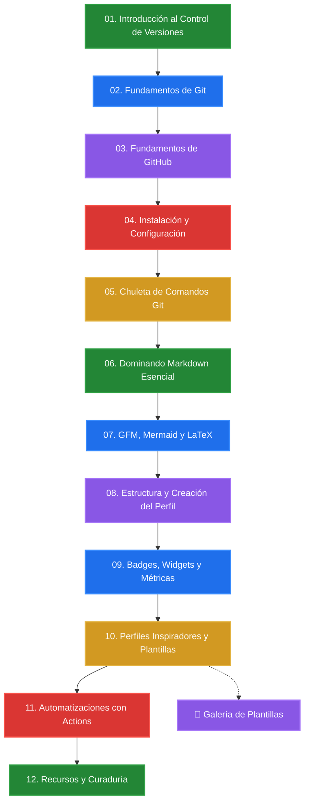

# 🚀 Guía Definitiva de Git, GitHub y Perfiles Profesionales

  <strong>Aprende control de versiones desde cero, domina Markdown y construye un perfil de GitHub de alto impacto.</strong>

---

## 📖 Acerca de este Proyecto

Esta guía está diseñada como una **ruta completa y modular** de aprendizaje tanto para principiantes que dan sus primeros pasos en el control de versiones como para desarrolladores que desean transformar su perfil de GitHub en un portafolio técnico interactivo.

> [!NOTE]
> 📜 Si deseas consultar la versión original de esta guía, se encuentra disponible [**aquí**](./old-version/README.md).

## 🗺️ Mapa de Aprendizaje (Roadmap)

```mermaid
flowchart TD
    A[01. Introducción al Control de Versiones] --> B[02. Fundamentos de Git]
    B --> C[03. Fundamentos de GitHub]
    C --> D[04. Instalación y Configuración]
    D --> E[05. Chuleta de Comandos Git]
    E --> F[06. Dominando Markdown Esencial]
    F --> G[07. GFM, Mermaid y LaTeX]
    G --> H[08. Estructura y Creación del Perfil]
    H --> I[09. Badges, Widgets y Métricas]
    I --> J[10. Perfiles Inspiradores y Plantillas]
    J --> K[11. Automatizaciones con Actions]
    K --> L[12. Recursos y Curaduría]
    J -.-> P[🎨 Galería de Plantillas]

    style A fill:#238636,stroke:#2ea043,stroke-width:2px,color:#fff
    style B fill:#1f6feb,stroke:#388bfd,stroke-width:2px,color:#fff
    style C fill:#8957e5,stroke:#a371f7,stroke-width:2px,color:#fff
    style D fill:#da3633,stroke:#f85149,stroke-width:2px,color:#fff
    style E fill:#d29922,stroke:#e3b341,stroke-width:2px,color:#fff
    style F fill:#238636,stroke:#2ea043,stroke-width:2px,color:#fff
    style G fill:#1f6feb,stroke:#388bfd,stroke-width:2px,color:#fff
    style H fill:#8957e5,stroke:#a371f7,stroke-width:2px,color:#fff
    style I fill:#1f6feb,stroke:#388bfd,stroke-width:2px,color:#fff
    style J fill:#d29922,stroke:#e3b341,stroke-width:2px,color:#fff
    style K fill:#da3633,stroke:#f85149,stroke-width:2px,color:#fff
    style L fill:#238636,stroke:#2ea043,stroke-width:2px,color:#fff
    style P fill:#8957e5,stroke:#a371f7,stroke-width:2px,color:#fff
```

## 📚 Índice de Contenidos

| Módulo | Descripción | Enlace |
| :--- | :--- | :---: |
| **01. Introducción** | ¿Por qué control de versiones?, Git vs GitHub y plataformas en la nube. | [👉 Leer Módulo 01](./01-introduccion.md) |
| **02. Fundamentos de Git** | Arquitectura de 4 áreas, estados de archivos y conceptos (Commit, Rama, HEAD). | [👉 Leer Módulo 02](./02-fundamentos-de-git.md) |
| **03. Fundamentos de GitHub** | Repositorios remotos, Forks, Pull Requests, Code Review y GitHub Flow. | [👉 Leer Módulo 03](./03-fundamentos-de-github.md) |
| **04. Instalación y Configuración** | Instalación multiplataforma, `git config`, SSH Keys, Tokens (PAT) y GitHub CLI (`gh`). | [👉 Leer Módulo 04](./04-instalacion-y-configuracion.md) |
| **05. Chuleta de Comandos Git** | Cheat sheet con comandos esenciales, avanzados (`switch`, `restore`, `stash`, `rebase`) y solución de conflictos. | [👉 Leer Módulo 05](./05-chuleta-comandos-git.md) |
| **06. Dominando Markdown** | Sintaxis esencial, formato de texto, listas, enlaces, imágenes, videos y tablas completas en Markdown y HTML. | [👉 Leer Módulo 06](./06-dominando-markdown.md) |
| **07. GFM, Mermaid y Avanzado** | Alertas oficiales (`[!NOTE]`, etc.), desplegables `
`, teclas `<kbd>`, diagramas Mermaid y fórmulas LaTeX. | [👉 Leer Módulo 07](./07-gfm-mermaid-y-avanzado.md) |
| **08. Estructura de Perfil y Proyectos** | Creación de cuenta, README especial (`username/username`) y estructura profesional de README para proyectos de software. | [👉 Leer Módulo 08](./08-estructura-y-creacion-perfil.md) |
| **09. Badges, Widgets y Métricas** | Contadores de visitas, banners SVG, badges personalizados, widgets de estadísticas, repo cards y gist cards. | [👉 Leer Módulo 09](./09-badges-widgets-y-metricas.md) |
| **10. Perfiles Inspiradores y Plantillas** | Casos reales de perfiles creativos (minimalistas, visuales, gamificados, data/IA), colecciones y acceso a plantillas. | [👉 Leer Módulo 10](./10-perfiles-inspiradores-y-plantillas.md) |
| **11. Automatizaciones con Actions** | GitHub Actions para tu perfil: Snake game, blog RSS, WakaTime, AoC badges, infografías y guestbook. | [👉 Leer Módulo 11](./11-automatizaciones-y-actions.md) |
| **12. Recursos y Curaduría** | Selección de los mejores videos con miniatura, cursos gratuitos, plataformas interactivas y libros recomendados. | [👉 Leer Módulo 12](./12-recursos-y-curaduria.md) |

## 🎨 Galería de Plantillas con Vista Previa en Vivo

Visita la [**Galería de Plantillas (`plantillas/`)**](./plantillas/README.md) para ver la **vista previa renderizada en vivo** y copiar el código Markdown de cada diseño:

- 💻 [**Plantilla Full-Stack Developer**](./plantillas/plantilla-fullstack.md) — Para desarrolladores frontend, backend y cloud con stack categorizado y proyectos.
- ✨ [**Plantilla Minimalista & Elegante**](./plantillas/plantilla-minimalista.md) — Diseño limpio, tipografía cuidada y enlaces directos sin sobrecarga.
- 🤖 [**Plantilla Data Science & AI**](./plantillas/plantilla-data-ia.md) — Para científicos de datos, ingenieros de ML, notebooks y modelos.
- 🎓 [**Plantilla Estudiante & Junior**](./plantillas/plantilla-junior.md) — Enfocada en aprendizaje activo, metas formativas y primeros proyectos.

## ⭐ Apoyo y Contribuciones

Si este material te resulta de utilidad:
- Dale una ⭐ a este repositorio en GitHub.
- Compártelo con compañeros de estudio o colegas de desarrollo.
- Sigue al autor original en [@ema28pro](https://github.com/ema28pro).
